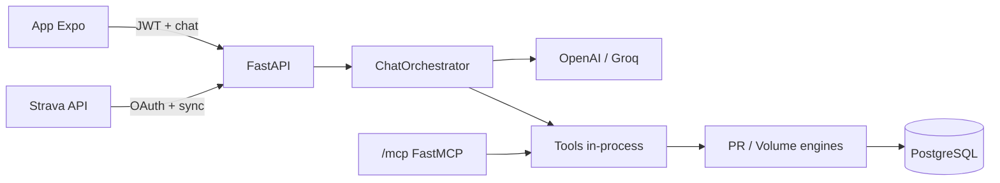

# ConverTreino

Assistente conversacional móvel que transforma dados de performance do Strava em insights acionáveis via chat.

O produto opera como um **Assistente Especialista Direcionado**: toda lógica analítica roda em serviços determinísticos; o LLM cuida apenas do entendimento de intenção, roteamento de ferramentas e formatação da resposta. Isso garante precisão matemática, controle de custo e segurança de execução.

## Estrutura do repositório

| Diretório | Descrição | Documentação |
|-----------|-----------|--------------|
| [`backend/`](backend/) | API FastAPI, sync Strava, engines analíticas, chat LLM, servidor MCP | [`backend/README.md`](backend/README.md) |
| [`mobile/`](mobile/) | App Expo (OAuth Strava, JWT, chat GiftedChat) | [`mobile/README.md`](mobile/README.md) |
| [`specs/`](specs/) | Especificações de design (SDD) | Ver índice abaixo |

## Início rápido

### Backend

```bash
cd backend
docker compose up -d
uv sync --all-extras --dev
uv run alembic upgrade head
uv run uvicorn convertreino.api.main:app --reload --app-dir src
```

Detalhes de OAuth Strava, JWT, chat, variáveis de ambiente, testes e ngrok: [`backend/README.md`](backend/README.md).

### Mobile

```bash
cd mobile
npm install
cp .env.example .env
npx expo start
```

Configure `EXPO_PUBLIC_API_BASE_URL` apontando para o backend (em dispositivo físico, use ngrok — veja [`mobile/README.md`](mobile/README.md)).

### Testes

```bash
# Backend (unitários + contrato, sem banco)
cd backend && uv run pytest -m "not integration"

# Mobile
cd mobile && npm test
```

## Capacidades principais

| Área | Specs | Resumo |
|------|-------|--------|
| Fundação backend | [SPEC-001](specs/SPEC-001-backend-foundation.md) | FastAPI, PostgreSQL, Alembic, CI |
| OAuth Strava | [SPEC-002](specs/SPEC-002-strava-oauth.md) | Autorização web e mobile |
| Sync de atividades | [SPEC-003](specs/SPEC-003-strava-activity-sync.md) | Importação e persistência |
| Webhooks Strava | [SPEC-004](specs/SPEC-004-strava-webhooks.md) | Atualização incremental |
| Engines PR / volume | [SPEC-005](specs/SPEC-005-pr-engine-longest-run.md)–[012](specs/SPEC-012-mcp-volume-tools.md) | Recorde e volume agregado Run/Ride |
| Autenticação JWT | [SPEC-013](specs/SPEC-013-jwt-auth.md) | Bearer token para app mobile |
| Chat conversacional | [SPEC-014](specs/SPEC-014-chat-api.md) | `POST /chat/messages`, loop LLM↔tools |
| App mobile | [SPEC-015](specs/SPEC-015-mobile-app.md) | Expo, deep link OAuth, chat |
| Provider Groq | [SPEC-017](specs/SPEC-017-groq-cloud-llm.md) | Alternativa ao OpenAI |
| Debug Phoenix | [SPEC-019](specs/SPEC-019-phoenix-local-debug.md) | Traces LLM locais (dev) |
| Schemas compactos | [SPEC-020](specs/SPEC-020-prompt-schema-compaction.md) | Tools enxutas no chat vs MCP verboso |

## Arquitetura (visão geral)



O chat e o servidor MCP compartilham os mesmos handlers analíticos; as descrições enviadas ao LLM no chat são compactas ([SPEC-020](specs/SPEC-020-prompt-schema-compaction.md)), enquanto o transporte MCP mantém contratos verbosos para clientes externos.
