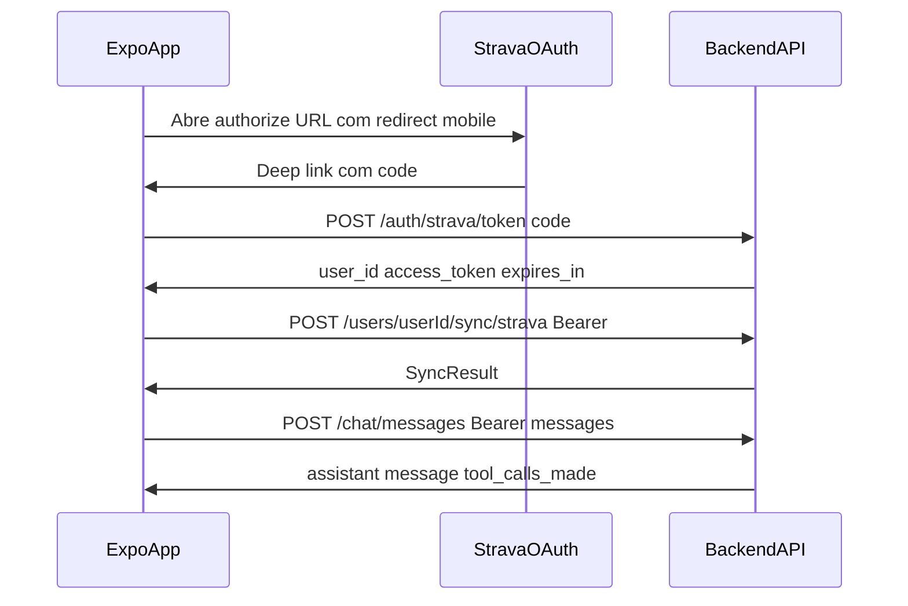
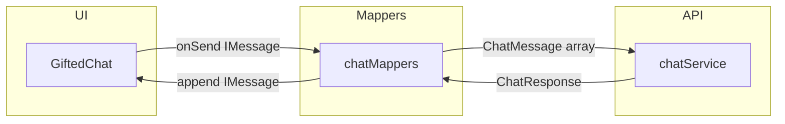

# SPEC-015 — App Mobile: OAuth Strava, sessão JWT e chat

| Campo          | Valor                                              |
|----------------|----------------------------------------------------|
| **Status**     | Draft                                              |
| **Autor**      | @convertreino                                      |
| **Revisor**    | —                                                  |
| **Criada em**  | 2026-06-19                                         |
| **Camada**     | Frontend (+ extensão API mínima)                   |
| **Depende de** | SPEC-002, SPEC-003, SPEC-013, SPEC-014             |
| **Bloqueia**   | Testes E2E reais app↔LLM, validação de `period_resolver` |
| **Épico**      | Conversacional                                     |

---

## Contexto

As specs SPEC-013 e SPEC-014 entregaram autenticação JWT e o endpoint conversacional `POST /chat/messages`. O repositório já possui scaffold Expo em [`mobile/`](../mobile/) (SDK 56, `expo-router`, `react-native-gesture-handler`, `react-native-reanimated`, `react-native-safe-area-context`), mas ainda faltam fluxos de auth/sync/chat, o endpoint `POST /auth/strava/token` e a integração com o backend. O usuário final precisa vincular a conta Strava, importar atividades e conversar com o assistente — hoje esse fluxo só é exercitável via curl no backend.

O callback OAuth existente (`GET /auth/strava/callback`) retorna JSON no browser após o redirect do Strava, o que é inadequado para OAuth in-app no dispositivo. O app mobile precisa capturar o `code` via deep link e trocá-lo por credenciais JWT no backend, sem expor `client_secret` no cliente.

---

## Escopo

### Incluído

**Evolução do projeto `mobile/` (Expo + TypeScript)**

Estado atual vs alvo:

| Item | Atual (`mobile/`) | Alvo (SPEC-015) |
|------|-------------------|-----------------|
| Scheme deep link | `mobile` ([`app.json`](../mobile/app.json)) | `convertreino` |
| App name/slug | `mobile` | `convertreino` (slug técnico pode permanecer; scheme OAuth = `convertreino://oauth/callback`) |
| Rotas | scaffold padrão (a criar) | `src/app/(auth)/login`, `src/app/(app)/chat` via expo-router |
| Env vars | ausentes | `EXPO_PUBLIC_*` em `app.config.ts` |
| Chat UI | ausente | [`react-native-gifted-chat`](https://github.com/FaridSafi/react-native-gifted-chat) |

- Evoluir scaffold Expo existente com `expo-router` para navegação e deep links
- `app.config.ts`: scheme `convertreino`, variáveis `EXPO_PUBLIC_*`
- Dependências a instalar:

```bash
npx expo install react-native-gifted-chat react-native-keyboard-controller
npx expo install expo-auth-session expo-secure-store
```

- Dependências **já presentes** em [`mobile/package.json`](../mobile/package.json) (não reinstalar): `expo-web-browser`, `expo-linking`, `react-native-gesture-handler`, `react-native-reanimated`, `react-native-safe-area-context`
- Módulos:
  - `src/config/env.ts` — `API_BASE_URL`, `STRAVA_CLIENT_ID`, `STRAVA_REDIRECT_URI`, `STRAVA_SCOPE`
  - `src/lib/stravaAuth.ts` — monta URL de autorização Strava (mesma query de `build_authorization_url` no backend)
  - `src/lib/chatMappers.ts` — conversão `ChatMessage` (API) ↔ `IMessage` (GiftedChat)
  - `src/services/apiClient.ts` — wrapper `fetch` com `Authorization: Bearer`
  - `src/services/authService.ts` — fluxo OAuth, persistência, restauração e checagem de expiração
  - `src/services/syncService.ts` — `POST /users/{userId}/sync/strava`
  - `src/services/chatService.ts` — `POST /chat/messages`
  - `src/context/AuthContext.tsx` — gate autenticado / não autenticado
- Telas:
  - **Login** — botão "Conectar com Strava"
  - **Sync** — indicador "Importando atividades..." (estado transitório pós-login)
  - **Chat** — componente `GiftedChat` com `isTyping` durante request ao backend
- `src/app/_layout.tsx` — `KeyboardProvider` de `react-native-keyboard-controller` montado uma vez na raiz
- Pós-login: **sync automático bloqueante** antes de liberar o chat
- `mobile/README.md` — setup, env vars, registro do redirect URI no painel Strava

**Extensão mínima de backend (contrato nesta spec)**

- Novo endpoint `POST /auth/strava/token` para troca de `code` OAuth por JWT
- Variável de ambiente `STRAVA_MOBILE_REDIRECT_URI` (opcional em dev web; obrigatória quando mobile usa redirect distinto)
- Extensão de `HttpxStravaApiClient.exchange_code` para enviar `redirect_uri` na troca do `code` quando configurado
- Testes de integração do novo endpoint em `backend/tests/integration/test_strava_oauth.py`

**Testes mobile**

- Jest + `@testing-library/react-native`
- Mocks de `fetch` para services
- Cobertura mínima **70%** em `src/services/*` e componentes críticos de UI (guia seção 8)

### Excluído (explicitamente fora desta spec)

- Streaming SSE / resposta token-a-token do LLM → SPEC-017+
- Features avançadas do GiftedChat: quick replies, emoji reactions, swipe-to-reply, anexos (imagem/vídeo/áudio), load earlier / paginação de histórico local
- Typing indicator em tempo real do LLM (distinto de `isTyping` como loading síncrono durante `POST /chat/messages`)
- Persistência server-side de conversas → SPEC-017+
- Persistência local de histórico de chat entre sessões (apenas memória em runtime; perde ao fechar app)
- Logout formal / refresh token / re-OAuth automático por expiração JWT (apenas limpar sessão e redirecionar ao login)
- Push notifications, widgets, gráficos, onboarding multi-step
- `period_resolver.py` server-side → SPEC-016+ (gatilho: CB-3 do nightly SPEC-021)
- Publicação App Store / Play Store
- Testes E2E Maestro/Detox com LLM real no CI → SPEC-017+
- Alteração das MCP tools, orchestrator ou contratos de chat da SPEC-014
- CI do monorepo para mobile (pode ser adicionado em spec futura de infra)

---

## Contrato — Extensão API (backend)

### `POST /auth/strava/token`

| Método | Path                  | Auth | Response 200                          |
|--------|-----------------------|------|---------------------------------------|
| POST   | `/auth/strava/token`  | Não  | Mesmo schema do callback SPEC-013     |

**Request body:**

```json
{
  "code": "<authorization_code>"
}
```

| Campo  | Tipo     | Obrigatório | Regras                          |
|--------|----------|-------------|---------------------------------|
| `code` | `string` | Sim         | Não vazio após `strip()`        |

**Response 200:**

```json
{
  "user_id": "<uuid>",
  "access_token": "<jwt>",
  "token_type": "bearer",
  "expires_in": 3600
}
```

| Campo          | Tipo     | Descrição                                              |
|----------------|----------|--------------------------------------------------------|
| `user_id`      | `string` | UUID interno (retrocompatível com SPEC-013)            |
| `access_token` | `string` | JWT HS256                                              |
| `token_type`   | `string` | Sempre `"bearer"`                                      |
| `expires_in`   | `int`    | Segundos até expiração (`JWT_EXPIRES_MINUTES * 60`)    |

| Código | Condição                                    | `detail` sugerido              |
|--------|---------------------------------------------|--------------------------------|
| 400    | `code` inválido ou expirado (`StravaAuthError`) | mensagem da exceção        |
| 422    | `code` ausente ou vazio                     | validação Pydantic             |

Assinatura do handler:

```python
# api/routes/strava_auth.py
@router.post("/token")
def exchange_token(
    body: StravaTokenRequest,
    oauth_service: StravaOAuthService = Depends(get_strava_oauth_service),
    jwt_service: JwtTokenService = Depends(get_jwt_token_service),
) -> dict[str, str | int]:
    ...
```

O handler reutiliza `StravaOAuthService.exchange_code(code)` e `JwtTokenService.create_access_token(user.id)` — mesma lógica do `GET /auth/strava/callback` (SPEC-013).

### Configuração backend (adição)

| Variável                    | Obrigatória | Default              | Descrição                                                       |
|-----------------------------|-------------|----------------------|-----------------------------------------------------------------|
| `STRAVA_MOBILE_REDIRECT_URI`| Não*        | `STRAVA_REDIRECT_URI`| Redirect URI usado na troca do `code` emitido pelo app mobile   |

\* Obrigatória quando o app mobile usa `EXPO_PUBLIC_STRAVA_REDIRECT_URI` diferente de `STRAVA_REDIRECT_URI` (ex.: `convertreino://oauth/callback` vs `http://localhost:8000/auth/strava/callback`). O Strava exige que o `redirect_uri` na troca do token coincida com o usado na autorização.

### Extensão `HttpxStravaApiClient.exchange_code`

```python
def exchange_code(self, code: str, *, redirect_uri: str | None = None) -> StravaTokenResponse:
    payload = {
        "client_id": self._client_id,
        "client_secret": self._client_secret,
        "code": code,
        "grant_type": "authorization_code",
    }
    if redirect_uri is not None:
        payload["redirect_uri"] = redirect_uri
    return self._request_token(payload)
```

`StravaOAuthService.exchange_code` passa `redirect_uri` de `STRAVA_MOBILE_REDIRECT_URI` (ou fallback para `STRAVA_REDIRECT_URI`) ao cliente Strava.

### Efeitos colaterais (backend)

- `exchange_code` persiste/atualiza tokens Strava no PostgreSQL (SPEC-002) — inalterado
- Emissão de JWT em memória (SPEC-013) — inalterado
- Nenhuma migration Alembic

---

## Contrato — App Mobile

### Fluxo ponta a ponta



### Tipos compartilhados (TypeScript)

```typescript
// src/types/auth.ts
export type AuthSession = {
  userId: string;       // UUID
  accessToken: string;  // JWT
  expiresAt: number;    // Unix ms (Date.now() + expires_in * 1000)
};

export type TokenResponse = {
  user_id: string;
  access_token: string;
  token_type: "bearer";
  expires_in: number;
};
```

```typescript
// src/types/chat.ts
export type ChatRole = "user" | "assistant";

export type ChatMessage = {
  role: ChatRole;
  content: string;
};

export type ChatResponse = {
  message: { role: "assistant"; content: string };
  tool_calls_made: string[];
};
```

```typescript
// src/types/sync.ts
export type SyncResult = {
  synced_count: number;
  created_count: number;
  updated_count: number;
  skipped_count: number;
};
```

```typescript
// src/types/giftedChat.ts
import type { IMessage } from "react-native-gifted-chat";

export const USER_GIFTED_ID = 1;
export const ASSISTANT_GIFTED_ID = 2;

export const giftedChatUsers = {
  user: { _id: USER_GIFTED_ID, name: "Você" },
  assistant: { _id: ASSISTANT_GIFTED_ID, name: "ConverTreino" },
} as const;
```

### Mapeamento API ↔ GiftedChat

```typescript
// src/lib/chatMappers.ts
import type { IMessage } from "react-native-gifted-chat";

export function toGiftedMessages(messages: ChatMessage[]): IMessage[];
export function toApiMessages(gifted: IMessage[]): ChatMessage[];
export function createUserGiftedMessage(text: string): IMessage;
export function createAssistantGiftedMessage(text: string): IMessage;
```

| Campo API | Campo GiftedChat |
|-----------|------------------|
| `role: "user"` | `user._id === USER_GIFTED_ID` |
| `role: "assistant"` | `user._id === ASSISTANT_GIFTED_ID` |
| `content` | `text` |
| — | `createdAt: new Date()` (ordem visual; API não envia timestamp) |
| — | `_id` gerado via `messageIdGenerator` ou UUID local |

`toApiMessages` filtra mensagens com `text` não vazio após `strip()`; ignora mensagens `system` e `pending`.

### Camadas do chat



### Configuração mobile (`EXPO_PUBLIC_*`)

| Variável                          | Obrigatória | Exemplo dev                         | Descrição                              |
|-----------------------------------|-------------|-------------------------------------|----------------------------------------|
| `EXPO_PUBLIC_API_BASE_URL`        | Sim         | `http://localhost:8000`             | Base URL da API FastAPI                |
| `EXPO_PUBLIC_STRAVA_CLIENT_ID`    | Sim         | mesmo do painel Strava              | Client ID público (sem secret)         |
| `EXPO_PUBLIC_STRAVA_REDIRECT_URI` | Sim         | `convertreino://oauth/callback`     | Deep link registrado no Strava         |

Constante fixa no código (espelha backend):

```typescript
export const STRAVA_SCOPE = "read,activity:read_all";
export const STRAVA_AUTHORIZE_URL = "https://www.strava.com/oauth/authorize";
```

### `buildStravaAuthorizationUrl`

```typescript
// src/lib/stravaAuth.ts
export function buildStravaAuthorizationUrl(params: {
  clientId: string;
  redirectUri: string;
  scope?: string;
}): string;
```

Query params obrigatórios (idênticos a [`build_authorization_url`](backend/src/convertreino/infrastructure/config.py)):

| Parâmetro          | Valor                    |
|--------------------|--------------------------|
| `client_id`        | `EXPO_PUBLIC_STRAVA_CLIENT_ID` |
| `redirect_uri`     | `EXPO_PUBLIC_STRAVA_REDIRECT_URI` |
| `response_type`    | `code`                   |
| `scope`            | `read,activity:read_all` |
| `approval_prompt`  | `auto`                   |

### `apiClient`

```typescript
// src/services/apiClient.ts
export class ApiError extends Error {
  constructor(
    message: string,
    readonly status: number,
    readonly detail?: string,
  ) { super(message); }
}

export async function apiFetch<T>(
  path: string,
  options: RequestInit & { accessToken?: string } = {},
): Promise<T>;
```

| Comportamento                         | Regra                                                    |
|---------------------------------------|----------------------------------------------------------|
| Header `Authorization`                | `Bearer ${accessToken}` quando `accessToken` fornecido   |
| Header `Content-Type`                 | `application/json` em requests com body                  |
| Response `!ok`                        | Lança `ApiError` com `status` e `detail` do body JSON    |
| Base URL                              | `${EXPO_PUBLIC_API_BASE_URL}${path}`                     |

### `authService`

```typescript
// src/services/authService.ts
const SESSION_KEY = "convertreino.auth.session";

export async function startStravaLogin(): Promise<AuthSession>;
export async function loadSession(): Promise<AuthSession | null>;
export async function clearSession(): Promise<void>;
export function isSessionValid(session: AuthSession): boolean;
```

| Função              | Comportamento                                                                 |
|---------------------|-------------------------------------------------------------------------------|
| `startStravaLogin`  | Abre browser in-app com URL Strava; captura `code` do deep link; chama `POST /auth/strava/token`; persiste `AuthSession` em SecureStore |
| `loadSession`       | Lê SecureStore; retorna `null` se ausente ou expirado (`expiresAt <= Date.now()`) |
| `clearSession`      | Remove entrada do SecureStore                                                 |
| `isSessionValid`    | `expiresAt > Date.now()`                                                      |

### `syncService`

```typescript
// src/services/syncService.ts
export async function syncStravaActivities(
  userId: string,
  accessToken: string,
): Promise<SyncResult>;
```

Chama `POST /users/${userId}/sync/strava` com Bearer (SPEC-003 + SPEC-013).

### `chatService`

```typescript
// src/services/chatService.ts
export async function sendChatMessage(
  accessToken: string,
  messages: ChatMessage[],
): Promise<ChatResponse>;
```

Chama `POST /chat/messages` com body `{ messages }` (SPEC-014). Última mensagem do array deve ser `role: "user"`.

### `AuthContext`

```typescript
// src/context/AuthContext.tsx
type AuthState =
  | { status: "loading" }
  | { status: "unauthenticated" }
  | { status: "syncing"; session: AuthSession }
  | { status: "authenticated"; session: AuthSession };

type AuthContextValue = {
  state: AuthState;
  login: () => Promise<void>;
  logout: () => Promise<void>;
};
```

| Estado             | UI renderizada                          |
|--------------------|-----------------------------------------|
| `loading`          | Splash / spinner                        |
| `unauthenticated`  | Tela Login                              |
| `syncing`          | Tela Sync com indicador de progresso    |
| `authenticated`    | Tela Chat                               |

### Telas

#### Login (`src/app/(auth)/login.tsx`)

- Título: "ConverTreino"
- Botão primário: "Conectar com Strava" → chama `authService.startStravaLogin()` + transição para `syncing`
- Mensagem de erro inline em falha OAuth (CE-1)

#### Sync (estado `syncing` — pode ser componente ou rota transitória)

- Texto: "Importando atividades..."
- Spinner
- Ao concluir sync (sucesso ou CB-1): transição para `authenticated`
- Em falha de sync (não 401): exibir erro com opção "Tentar novamente" ou "Continuar mesmo assim" (decisão: **continuar para chat** em erro de sync não-auth, com aviso)

#### Chat (`src/app/(app)/chat.tsx`)

UI baseada em [`react-native-gifted-chat`](https://github.com/FaridSafi/react-native-gifted-chat) v3.x:

```typescript
import { GiftedChat } from "react-native-gifted-chat";
import "dayjs/locale/pt-br";

<GiftedChat
  messages={giftedMessages}
  onSend={handleSend}
  user={giftedChatUsers.user}
  isTyping={isLoading}
  renderAvatar={() => null}
  locale="pt-br"
  placeholder="Pergunte sobre seus treinos..."
  disableKeyboardProvider
  keyboardAvoidingViewProps={{ keyboardVerticalOffset: headerHeight }}
/>
```

Props obrigatórias:

| Prop | Valor / regra |
|------|----------------|
| `user` | `{ _id: USER_GIFTED_ID }` |
| `isTyping` | `true` enquanto aguarda `POST /chat/messages` |
| `renderAvatar` | `() => null` (sem avatares na POC) |
| `locale` | `"pt-br"` (importar `dayjs/locale/pt-br`) |
| `disableKeyboardProvider` | `true` — `KeyboardProvider` montado na raiz em `src/app/_layout.tsx` |
| `isSendButtonAlwaysVisible` | `false` (default — input vazio não envia, CB-4) |

Fluxo de `handleSend`:

1. Recebe `messages` do GiftedChat (tipicamente 1 item `user`)
2. Faz `GiftedChat.append` otimista na UI
3. Monta `ChatMessage[]` via `toApiMessages` + nova mensagem
4. Chama `chatService.sendChatMessage`
5. Faz `append` da resposta `assistant` via `createAssistantGiftedMessage`
6. Em erro: mantém mensagem `user`; exibe banner/alert (CE-3, CE-5); **não** usa `pending`/`sent` ticks nesta spec

- Banner de erro retryável em falha (CE-3, CE-5)
- `tool_calls_made` ignorado na UI de produção (CB-3); não renderizar em `renderCustomView`

### Efeitos colaterais (mobile)

- Escrita em `expo-secure-store` ao login (JWT + metadados)
- Leitura de SecureStore no cold start
- Chamadas HTTP ao backend (OAuth token, sync, chat)
- Chamada ao browser in-app para OAuth Strava (sem persistência além do `code`)

---

## Comportamentos

### Casos normais (Happy Path)

#### CN-1: Usuário não autenticado vê tela de login
**Dado** que não há `AuthSession` válida em SecureStore  
**Quando** o app inicia  
**Então** `AuthContext.state.status == "unauthenticated"`  
**E** a tela Login é exibida com botão "Conectar com Strava"

#### CN-2: OAuth Strava completo e sessão persistida
**Dado** que o usuário toca "Conectar com Strava"  
**E** o browser in-app completa OAuth com sucesso  
**Quando** o deep link retorna `code` válido  
**Então** o app chama `POST /auth/strava/token` com `{ "code": "..." }`  
**E** persiste `AuthSession` em SecureStore com `userId`, `accessToken` e `expiresAt` corretos

#### CN-3: Sync automático pós-login
**Dado** que CN-2 concluiu com sucesso  
**Quando** o app entra em estado `syncing`  
**Então** chama `POST /users/{userId}/sync/strava` com `Authorization: Bearer <accessToken>`  
**E** após `200`, transiciona para `authenticated` e exibe Chat

#### CN-4: Envio de mensagem no chat
**Dado** que o usuário está autenticado no Chat  
**Quando** digita texto não vazio e envia via composer do GiftedChat  
**Então** a mensagem `user` aparece no `GiftedChat` via `GiftedChat.append`  
**E** `isTyping` fica `true` durante o request  
**E** `POST /chat/messages` é chamado com Bearer e `messages` incluindo a nova mensagem  
**E** a resposta `assistant` é adicionada ao `GiftedChat` via `createAssistantGiftedMessage`

#### CN-5: Multi-turn preserva histórico no cliente
**Dado** um histórico com mensagens anteriores `user` / `assistant`  
**Quando** o usuário envia uma segunda mensagem  
**Então** o body de `POST /chat/messages` contém todo o histórico na ordem correta  
**E** a última mensagem tem `role: "user"`

#### CN-6: Cold start com sessão válida
**Dado** que SecureStore contém `AuthSession` com `expiresAt > Date.now()`  
**Quando** o app inicia  
**Então** pula Login  
**E** transiciona direto para Chat (`authenticated`) sem novo OAuth  
**E** não dispara sync automático (apenas no login fresco)

### Casos de borda (Edge Cases)

#### CB-1: Sync sem atividades retorna contagens zeradas
**Dado** que o atleta Strava não possui atividades  
**Quando** `syncStravaActivities` retorna `{ synced_count: 0, ... }`  
**Então** o app transiciona para Chat normalmente  
**E** não exibe erro

#### CB-2: Usuário cancela OAuth no browser
**Dado** que o usuário abre o browser in-app  
**Quando** fecha/cancela sem completar OAuth  
**Então** permanece em `unauthenticated` na tela Login  
**E** não há crash nem sessão parcial persistida

#### CB-3: Resposta com `tool_calls_made` preenchido
**Dado** que `POST /chat/messages` retorna `tool_calls_made: ["get_longest_run"]`  
**Quando** a UI renderiza a resposta no GiftedChat  
**Então** exibe apenas `message.content` como bolha `assistant`  
**E** não exibe metadados de tools na interface de produção (sem `renderCustomView`)

#### CB-4: Input vazio não envia mensagem
**Dado** que o composer do GiftedChat está vazio ou só espaços  
**Quando** o usuário tenta enviar  
**Então** o botão enviar permanece oculto (`isSendButtonAlwaysVisible: false`) ou a ação é ignorada  
**E** nenhuma chamada a `/chat/messages` é feita

### Casos de erro

#### CE-1: Troca de `code` falha
**Dado** que `POST /auth/strava/token` retorna `400`  
**Quando** o fluxo OAuth tenta completar  
**Então** exibe mensagem "Falha ao conectar Strava" (ou `detail` da API)  
**E** permanece na tela Login sem sessão persistida

#### CE-2: API retorna 401
**Dado** que o JWT expirou ou é inválido  
**Quando** qualquer chamada autenticada (`sync` ou `chat`) retorna `401`  
**Então** `clearSession()` é chamado  
**E** o app redireciona para Login com mensagem indicando que a sessão expirou

#### CE-3: Chat retorna 502
**Dado** que `POST /chat/messages` retorna `502` (`LLM provider unavailable`)  
**Quando** o usuário enviou uma mensagem  
**Então** `isTyping` volta para `false`  
**E** exibe erro retryável (banner ou alert)  
**E** a mensagem `user` permanece no array `messages` do GiftedChat (não removida)

#### CE-4: Chat retorna 422
**Dado** um body inválido (não deve ocorrer se UI valida corretamente)  
**Quando** `POST /chat/messages` retorna `422`  
**Então** exibe erro genérico de validação  
**E** não corrompe o histórico local

#### CE-5: Rede indisponível
**Dado** que `fetch` falha por erro de rede (sem response HTTP)  
**Quando** qualquer service faz chamada à API  
**Então** exibe mensagem "Sem conexão. Tente novamente."  
**E** não limpa sessão (exceto se combinado com 401)

#### CE-6: Sync falha com erro não-auth
**Dado** que `POST /users/{userId}/sync/strava` retorna `502` ou erro de rede  
**Quando** o app está em estado `syncing`  
**Então** exibe aviso de falha na importação  
**E** permite continuar para Chat (dados podem estar desatualizados)

---

## Critérios de Aceite

- [ ] Spec com status **Draft** em `specs/SPEC-015-mobile-app.md`
- [ ] Scaffold Expo em `mobile/` evoluído para fluxo auth/sync/chat (`npx expo start`)
- [ ] `react-native-gifted-chat` e `react-native-keyboard-controller` instalados via `expo install`
- [ ] Scheme `convertreino` configurado em `app.config.ts` / `app.json` (substituir `mobile` atual)
- [ ] Deep link `convertreino://oauth/callback` configurado
- [ ] OAuth Strava: app monta URL, captura `code`, chama `POST /auth/strava/token`
- [ ] `POST /auth/strava/token` implementado no backend com testes de integração
- [ ] JWT persistido em `expo-secure-store` e restaurado no cold start (CN-6)
- [ ] Sync automático pós-login com Bearer (CN-3)
- [ ] Tela Chat usa `GiftedChat` (não lista custom)
- [ ] `isTyping={true}` durante request ao backend
- [ ] `locale="pt-br"` configurado no GiftedChat
- [ ] Mapper `chatMappers.ts` com testes unitários
- [ ] Tela de chat funcional contra backend local com `OPENAI_API_KEY` configurada
- [ ] Multi-turn: histórico completo enviado a cada mensagem (CN-5)
- [ ] Um teste por CN/CB/CE documentado
- [ ] Cobertura >= 70% em `mobile/src/services/*` e `mobile/src/lib/chatMappers.ts`
- [ ] `mobile/README.md` com env vars e instruções de redirect no painel Strava
- [ ] `STRAVA_MOBILE_REDIRECT_URI` documentada no `backend/README.md`
- [ ] Roadmap da SPEC-014 atualizado (`period_resolver` → SPEC-018+)
- [ ] Não contradiz contratos de SPEC-002, SPEC-003, SPEC-013 nem SPEC-014

---

## Mapeamento Spec → Testes

| Artefato                              | Localização                                                         |
|---------------------------------------|---------------------------------------------------------------------|
| CN/CB/CE `authService`                | `mobile/src/services/__tests__/authService.test.ts`                 |
| CN/CB/CE `chatService`                | `mobile/src/services/__tests__/chatService.test.ts`                 |
| CN/CB/CE `syncService`                | `mobile/src/services/__tests__/syncService.test.ts`                 |
| Contrato `apiClient` + Bearer         | `mobile/src/services/__tests__/apiClient.test.ts`                   |
| `buildStravaAuthorizationUrl`         | `mobile/src/lib/__tests__/stravaAuth.test.ts`                       |
| `toGiftedMessages` / `toApiMessages`  | `mobile/src/lib/__tests__/chatMappers.test.ts`                      |
| CN-4, CB-4 UI chat (mock GiftedChat)  | `mobile/src/app/(app)/__tests__/chat.test.tsx`                      |
| CN-1, CN-2 Login                      | `mobile/src/app/(auth)/__tests__/login.test.tsx`                    |
| CN-2 backend `POST /auth/strava/token`| `backend/tests/integration/test_strava_oauth.py`                    |
| Contrato assinatura services          | testes de tipo ou snapshot de exports públicos                      |

Testes mobile usam mocks de `fetch`, `expo-secure-store` e `react-native-gifted-chat` — sem chamadas de rede reais no CI.

---

## Decisões de Design

### Decisão: Expo + expo-router
**Contexto:** Stack mobile para POC do ConverTreino.  
**Opção escolhida:** Expo (React Native) com `expo-router` para navegação e deep links.  
**Alternativas rejeitadas:** React Native CLI bare; Flutter.  
**Motivo:** Time-to-market; deep links e OAuth in-app bem suportados; alinhado ao ecossistema React.

### Decisão: App monta URL OAuth (não chama `GET /authorize`)
**Contexto:** Como obter a URL de autorização Strava no mobile.  
**Opção escolhida:** `buildStravaAuthorizationUrl` no app com `EXPO_PUBLIC_STRAVA_CLIENT_ID` e redirect mobile.  
**Alternativas rejeitadas:** Chamar `GET /auth/strava/authorize` do backend (retorna redirect do servidor, não do mobile).  
**Motivo:** Redirect URI do mobile difere do callback web; `client_secret` nunca sai do backend.

### Decisão: `POST /auth/strava/token` para troca de `code`
**Contexto:** Callback web retorna JSON no browser — inadequado para OAuth in-app.  
**Opção escolhida:** Novo endpoint POST; app envia `code` capturado via deep link.  
**Alternativas rejeitadas:** Página HTML no callback que redireciona para deep link com token na URL; montar troca de token no app (exporia `client_secret`).  
**Motivo:** Segurança (`client_secret` no servidor); simetria com response do callback SPEC-013.

### Decisão: `redirect_uri` na troca do token Strava
**Contexto:** Código OAuth emitido com redirect mobile pode exigir `redirect_uri` na troca.  
**Opção escolhida:** `STRAVA_MOBILE_REDIRECT_URI` no backend; `exchange_code` envia `redirect_uri` ao Strava quando configurado.  
**Alternativas rejeitadas:** Assumir que Strava aceita troca sem `redirect_uri`; unificar redirect web e mobile.  
**Motivo:** Strava valida paridade authorize/token; mobile e web coexistem na POC.

### Decisão: SecureStore para JWT
**Contexto:** Onde persistir `AuthSession` no dispositivo.  
**Opção escolhida:** `expo-secure-store`.  
**Alternativas rejeitadas:** `AsyncStorage` plain text; memória apenas (sem cold start).  
**Motivo:** Credencial sensível; restauração de sessão no CN-6.

### Decisão: Sync bloqueante pós-login
**Contexto:** Quando importar atividades Strava.  
**Opção escolhida:** Sync automático em estado `syncing` antes do primeiro acesso ao chat após login.  
**Alternativas rejeitadas:** Sync em background após entrar no chat; sync manual via botão.  
**Motivo:** Primeira pergunta analítica exige dados no banco (SPEC-003); UX clara com indicador de progresso.

### Decisão: Histórico de chat só em memória (runtime)
**Contexto:** Persistência de conversas no dispositivo.  
**Opção escolhida:** Estado React em memória; perdido ao fechar app.  
**Alternativas rejeitadas:** AsyncStorage de mensagens; persistência server-side.  
**Motivo:** Escopo mínimo da POC; alinhado ao servidor stateless (SPEC-014); persistência em SPEC-017+.

### Decisão: Continuar para chat após falha de sync não-auth
**Contexto:** Comportamento quando sync falha com 502/rede (CE-6).  
**Opção escolhida:** Permitir entrar no chat com aviso; usuário pode conversar (respostas podem indicar ausência de dados).  
**Alternativas rejeitadas:** Bloquear chat até sync bem-sucedido; retry infinito.  
**Motivo:** Evita dead-end; webhooks (SPEC-004) podem ter sincronizado dados parcialmente.

### Decisão: `react-native-gifted-chat` para UI de chat
**Contexto:** Implementar lista + composer + keyboard handling do zero vs biblioteca.  
**Opção escolhida:** [`react-native-gifted-chat`](https://github.com/FaridSafi/react-native-gifted-chat) v3.x.  
**Alternativas rejeitadas:** UI custom com `FlatList`; Stream Chat SDK.  
**Motivo:** Compatível com Expo SDK 50+; keyboard handling pronto; `isTyping` cobre loading da POC; menos código de UI.

### Decisão: mapper API ↔ GiftedChat
**Contexto:** API usa `{ role, content }`; GiftedChat usa `{ _id, text, user, createdAt }`.  
**Opção escolhida:** `chatMappers.ts` isolado; tela não conhece formato da API diretamente no render.  
**Alternativas rejeitadas:** Converter inline no componente Chat; duplicar estado em dois formatos sem mapper.  
**Motivo:** Separação de contratos; testes unitários do mapper sem montar componente.

### Decisão: `KeyboardProvider` na raiz + `disableKeyboardProvider` no GiftedChat
**Contexto:** GiftedChat monta `KeyboardProvider` por padrão; double-wrap pode causar layout shift no Android/Expo.  
**Opção escolhida:** Um `KeyboardProvider` em `src/app/_layout.tsx`; `disableKeyboardProvider` no `GiftedChat`.  
**Alternativas rejeitadas:** Provider padrão do GiftedChat em cada tela.  
**Motivo:** Recomendação da lib; evita flicker e salto de header.

### Decisão: Testes mobile sem E2E real no CI
**Contexto:** Como validar o app no CI.  
**Opção escolhida:** Jest + Testing Library com mocks de `fetch` e SecureStore.  
**Alternativas rejeitadas:** Maestro/Detox com backend + OpenAI reais no CI de cada PR.  
**Motivo:** CI rápido e determinístico; E2E real em SPEC-017+.

---

## Notas de Migração

- Evoluir scaffold `mobile/` existente (não criar do zero); substituir template padrão por rotas de produto
- Alterar scheme de `mobile` → `convertreino` em [`app.json`](../mobile/app.json) (breaking para deep links já configurados em dev)
- Novo endpoint `POST /auth/strava/token` — sem breaking change em rotas existentes
- Nova env var backend: `STRAVA_MOBILE_REDIRECT_URI` (opcional se igual a `STRAVA_REDIRECT_URI`)
- Registrar `convertreino://oauth/callback` (ou URI Expo dev) no painel Strava como Authorization Callback
- `GET /auth/strava/callback` permanece para fluxo web/curl (SPEC-002/013)
- Rollback mobile: reverter para scaffold anterior — sem impacto em dados
- Rollback backend: remover rota `POST /token` e extensão `redirect_uri` em `exchange_code`

---

## Roadmap pós-SPEC-015

| Spec futura | Conteúdo                                                                                    |
|-------------|---------------------------------------------------------------------------------------------|
| SPEC-017    | Groq Cloud como provider LLM alternativo                                                   |
| SPEC-021    | E2E nightly de acurácia do chat com LLM real (backend)                                      |
| SPEC-018    | `period_resolver` server-side (gatilho: CB-3 do nightly SPEC-021 falhar ≥ 3 noites em ambos providers) |
| SPEC-019+   | Streaming SSE, persistência de conversas, logout/refresh, rate limiting, CI mobile E2E      |

---

## Checklist de revisão (seção 12 do guia)

### Clareza
- [ ] O contexto explica o problema sem descrever a solução?
- [ ] O contrato tem tipos explícitos para todos os inputs e outputs?
- [ ] Cada comportamento tem "Dado / Quando / Então" completo?
- [ ] Os critérios de aceite são binários e verificáveis?

### Completude
- [ ] Há ao menos um caso normal (CN-1 a CN-6)?
- [ ] Casos de borda cobertos (sync vazio, cancel OAuth, input vazio)?
- [ ] Casos de erro especificados (400, 401, 422, 502, rede, sync falho)?
- [ ] Escopo "Excluído" deixa claro o que ficou de fora (streaming, features avançadas GiftedChat, persistência, period_resolver)?

### Consistência
- [ ] Não contradiz SPEC-002, SPEC-003, SPEC-013 nem SPEC-014?
- [ ] Tipos alinhados aos schemas backend (`ChatMessageRequest`, `SyncResult`, token response)?
- [ ] `client_secret` nunca no mobile?
- [ ] Histórico multi-turn consistente com servidor stateless (SPEC-014)?
- [ ] Mapeamento `ChatMessage` ↔ `IMessage` documentado e testável?

### Testabilidade
- [ ] Cada comportamento mapeia para teste unitário ou de integração?
- [ ] Comportamentos determinísticos com mocks de `fetch`?
- [ ] Efeitos colaterais explicitados (SecureStore, HTTP) e testáveis?
