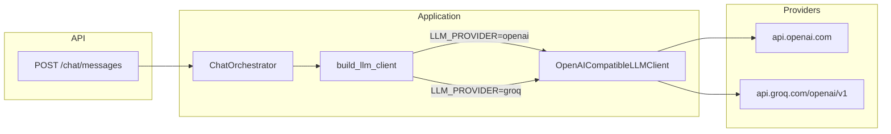

# SPEC-017 — Groq Cloud como provider LLM alternativo

| Campo          | Valor                                              |
|----------------|----------------------------------------------------|
| **Status**     | Draft                                              |
| **Autor**      | @convertreino                                      |
| **Revisor**    | —                                                  |
| **Criada em**  | 2026-06-19                                         |
| **Camada**     | Application + Infra (config) + extensão mínima mobile |
| **Depende de** | SPEC-014 (chat API, `LLMClient`, `OpenAICompatibleLLMClient`) |
| **Bloqueia**   | SPEC-021 (E2E nightly com Groq real)               |
| **Épico**      | Conversacional                                     |

---

## Contexto

A SPEC-014 entregou a abstração `LLMClient` provider-agnostic e o loop tool-use do `ChatOrchestrator`, mas a implementação concreta era exclusivamente OpenAI via SDK oficial. Groq Cloud expõe uma API **compatível com OpenAI** (`base_url=https://api.groq.com/openai/v1`) e suporta **local tool calling** — requisito crítico para o loop em `application/chat_orchestrator.py`.

A motivação é operacional: tier gratuito generoso para dev/POC, latência baixa e onboarding sem cartão de crédito. O ConverTreino continua delegando cálculos às tools determinísticas; o provider afeta apenas roteamento de intenção e formatação da resposta.



---

## Escopo

### Incluído

**Backend — refatoração mínima do client existente**

- Generalização de `OpenAILLMClient` para **`OpenAICompatibleLLMClient`** em `application/llm/openai_client.py`:
  - Parâmetros: `api_key`, `model`, `base_url: str | None = None`, `provider_name: Literal["openai", "groq"]`
  - Quando `base_url` é `None`, usa endpoint OpenAI padrão
  - Quando `provider_name == "groq"`, usa `base_url="https://api.groq.com/openai/v1"`
  - Mesma lógica de mapeamento `_to_openai_messages`, `_to_openai_tools`, `_parse_arguments` (sem duplicação)
  - Alias `OpenAILLMClient = OpenAICompatibleLLMClient` para retrocompatibilidade de imports
- Factory **`build_llm_client(settings: ChatSettings) -> LLMClient`** em `application/llm/factory.py`
- Atualização de `infrastructure/config.py`:

| Variável | Obrigatória | Default | Descrição |
|---|---|---|---|
| `LLM_PROVIDER` | Não | `openai` | `openai` ou `groq` |
| `OPENAI_API_KEY` | Sim* se provider=openai | `"test-openai-key"` em pytest | Chave OpenAI |
| `OPENAI_MODEL` | Não | `gpt-4o-mini` | Modelo OpenAI |
| `GROQ_API_KEY` | Sim* se provider=groq | `"test-groq-key"` em pytest | Chave Groq |
| `GROQ_MODEL` | Não | `llama-3.3-70b-versatile` | Modelo Groq com tool calling |
| `CHAT_MAX_TOOL_ITERATIONS` | Não | `5` | Inalterado |

\* Falha explícita na construção do client se a chave do provider ativo estiver vazia (fora de pytest).

- Atualização de `api/dependencies.py`: `_build_chat_orchestrator` chama `build_llm_client(settings)` em vez de instanciar OpenAI diretamente
- Tratamento de erros ampliado em `OpenAICompatibleLLMClient.complete`:
  - `429` / rate limit Groq → `LLMProviderError("LLM rate limit exceeded")`
  - OpenAI `insufficient_quota` → mantém `LLMProviderError("LLM quota exceeded")`
  - Demais erros → `LLMProviderError("LLM provider unavailable")`
- Import explícito de `RateLimitError` do SDK (substitui check frágil via `type(exc).__name__`)
- Atualização de `backend/.env.example` e `backend/README.md`

**Mobile — mensagens provider-agnostic**

- Ajuste em `mobile/src/app/(app)/chat.tsx`:
  - `"LLM quota exceeded"` e `"LLM rate limit exceeded"` → *"Limite do serviço de IA atingido. Tente novamente mais tarde."*
  - Remoção de referência a `platform.openai.com`

**Testes**

- Novo `backend/tests/unit/application/llm/test_llm_factory.py`:
  - CN: `LLM_PROVIDER=openai` → client com endpoint OpenAI default
  - CN: `LLM_PROVIDER=groq` → client com `base_url` Groq e modelo default
  - CE: provider=groq sem `GROQ_API_KEY` → `ValueError`
  - CE: provider inválido → `ValueError`
- Atualização de `backend/tests/unit/application/llm/test_openai_client.py`:
  - Testes de mapeamento com `base_url` customizado (mock)
  - CE: rate limit → `"LLM rate limit exceeded"`
  - CE: quota OpenAI → `"LLM quota exceeded"`
- Nenhuma nova dependência Python (SDK `openai` já suporta `base_url`)

### Excluído (explicitamente fora desta spec)

- Fallback automático entre providers
- LiteLLM ou proxy intermediário
- Testes E2E/CI com Groq real (continua `FakeLLMClient`)
- Streaming, persistência de conversas, rate limiting server-side
- Alteração de contrato HTTP (`POST /chat/messages` inalterado)
- Alteração de tools, orchestrator ou system prompt
- Remoção do suporte OpenAI

---

## Contrato

### `ChatSettings` estendido

```python
@dataclass(frozen=True, slots=True)
class ChatSettings:
    llm_provider: Literal["openai", "groq"]
    openai_api_key: str
    openai_model: str
    groq_api_key: str
    groq_model: str
    max_tool_iterations: int
```

### `build_llm_client`

```python
# application/llm/factory.py
def build_llm_client(settings: ChatSettings) -> LLMClient: ...
```

| Input | Output | Erro |
|---|---|---|
| `ChatSettings` com provider válido e chave presente | `LLMClient` configurado | `ValueError` se provider inválido ou chave ausente |

### `OpenAICompatibleLLMClient`

```python
# application/llm/openai_client.py
class OpenAICompatibleLLMClient:
    def __init__(
        self,
        *,
        api_key: str,
        model: str = "gpt-4o-mini",
        base_url: str | None = None,
        provider_name: Literal["openai", "groq"] = "openai",
    ) -> None: ...

    def complete(
        self,
        messages: list[ChatMessage],
        tools: list[ToolDefinition],
    ) -> LLMCompletion: ...
```

| Método | Input | Output | Erro |
|---|---|---|---|
| `complete` | `messages`, `tools` | `LLMCompletion` | `LLMProviderError` |

### Modelos Groq suportados (documentação, não validação runtime)

| Modelo | Tool calling | Uso recomendado |
|---|---|---|
| `llama-3.3-70b-versatile` | Sim | Default — melhor qualidade para datas/períodos |
| `llama-3.1-8b-instant` | Sim | Dev com limites diários maiores |
| `meta-llama/llama-4-scout-17b-16e-instruct` | Sim | Alternativa |

### API HTTP — sem breaking changes

| Código | Condição | `detail` |
|---|---|---|
| 502 | Rate limit Groq | `"LLM rate limit exceeded"` |
| 502 | Quota OpenAI | `"LLM quota exceeded"` |
| 502 | Outros erros provider | `"LLM provider unavailable"` |

Contrato de `POST /chat/messages` permanece idêntico à SPEC-014.

---

## Comportamentos

### Casos normais (Happy Path)

#### CN-1: Provider Groq configurado
**Dado** que `LLM_PROVIDER=groq` e `GROQ_API_KEY` está definida  
**Quando** `build_llm_client(get_chat_settings())` é invocado  
**Então** retorna `OpenAICompatibleLLMClient` com `base_url=https://api.groq.com/openai/v1`  
**E** modelo default `llama-3.3-70b-versatile`  
**E** override de `FakeLLMClient` em testes permanece inalterado

#### CN-2: Provider OpenAI (default) retrocompatível
**Dado** que `LLM_PROVIDER` está ausente ou igual a `openai`  
**Quando** o orchestrator é construído em produção  
**Então** comportamento idêntico à SPEC-014 (endpoint OpenAI padrão, `gpt-4o-mini`)

#### CN-3: Troca de provider via env vars
**Dado** um deploy existente com OpenAI  
**Quando** o operador altera apenas `LLM_PROVIDER`, `GROQ_API_KEY` e opcionalmente `GROQ_MODEL`  
**Então** nenhuma alteração de código é necessária

### Casos de borda (Edge Cases)

#### CB-1: `LLM_PROVIDER` case-insensitive
**Dado** que `LLM_PROVIDER=GROQ` (maiúsculas)  
**Quando** `get_chat_settings()` normaliza o valor  
**Então** provider efetivo é `groq`

#### CB-2: Provider Groq ignora chave OpenAI vazia
**Dado** que `LLM_PROVIDER=groq`, `GROQ_API_KEY` presente e `OPENAI_API_KEY` vazia  
**Quando** `build_llm_client` constrói o client  
**Então** inicialização bem-sucedida (não exige `OPENAI_API_KEY`)

### Casos de erro

#### CE-1: Provider inválido
**Dado** que `LLM_PROVIDER=invalid`  
**Quando** `build_llm_client` é invocado  
**Então** levanta `ValueError` com mensagem indicando valores aceitos (`openai`, `groq`)

#### CE-2: Groq sem chave em produção
**Dado** que `LLM_PROVIDER=groq` e `GROQ_API_KEY` está vazia fora de pytest  
**Quando** `build_llm_client` é invocado  
**Então** levanta `ValueError("GROQ_API_KEY is required")`

#### CE-3: Groq retorna 429 (rate limit)
**Dado** que `OpenAICompatibleLLMClient` recebe `RateLimitError` sem `insufficient_quota`  
**Quando** `complete` propaga a falha  
**Então** levanta `LLMProviderError("LLM rate limit exceeded")`  
**E** o endpoint retorna `502` com o mesmo `detail`

#### CE-4: OpenAI retorna insufficient_quota
**Dado** que `OpenAICompatibleLLMClient` recebe `RateLimitError` contendo `insufficient_quota`  
**Quando** `complete` propaga a falha  
**Então** levanta `LLMProviderError("LLM quota exceeded")`  
**E** o endpoint retorna `502` com o mesmo `detail`

---

## Critérios de Aceite

- [ ] `LLM_PROVIDER=openai|groq` documentado e funcional
- [ ] Retrocompatibilidade: sem `LLM_PROVIDER` → OpenAI como hoje
- [ ] Factory valida chave do provider ativo
- [ ] Groq usa `base_url=https://api.groq.com/openai/v1`
- [ ] Tool calling inalterado (4 tools, loop orchestrator)
- [ ] Erros 429/quota mapeados para `detail` distintos
- [ ] Mobile sem referência à OpenAI nos banners de erro
- [ ] Testes unitários CN/CB/CE + CI verde
- [ ] `.env.example` e README atualizados
- [ ] Nenhuma migration; nenhuma dependência nova

---

## Mapeamento Spec → Testes

| Artefato | Localização |
|---|---|
| Factory + validação provider | `backend/tests/unit/application/llm/test_llm_factory.py` |
| Mapeamento + erros client | `backend/tests/unit/application/llm/test_openai_client.py` |
| Orchestrator (sem mudança) | `backend/tests/unit/application/test_chat_orchestrator.py` (existente) |
| Endpoint (sem mudança contrato) | `backend/tests/integration/test_chat_messages.py` (existente) |

---

## Decisões de Design

### Decisão: generalizar client OpenAI-compatible em vez de `GroqLLMClient` separado
**Contexto:** Como integrar Groq sem duplicar lógica de mapeamento.  
**Opção escolhida:** Um único `OpenAICompatibleLLMClient` com `base_url` configurável.  
**Alternativas rejeitadas:** `GroqLLMClient` duplicando mapeamento; LiteLLM.  
**Motivo:** Groq é API-compatible; evita duplicação; SPEC-014 já previa extensão provider-agnostic.

### Decisão: seleção exclusiva via `LLM_PROVIDER`
**Contexto:** Como escolher o provider em runtime.  
**Opção escolhida:** Um provider por deploy (`openai` default, `groq` alternativo).  
**Alternativas rejeitadas:** Fallback automático; substituir OpenAI por Groq.  
**Motivo:** Escopo mínimo; previsibilidade de custo/limites; escolha explícita do operador.

### Decisão: default Groq `llama-3.3-70b-versatile`
**Contexto:** Qual modelo Groq usar na POC.  
**Opção escolhida:** `llama-3.3-70b-versatile` como default de `GROQ_MODEL`.  
**Alternativas rejeitadas:** Modelos menores como default; validação runtime de lista fechada.  
**Motivo:** Melhor equilíbrio qualidade/tool-use para conversão de períodos e seleção entre 4 tools.

### Decisão: mensagens de erro provider-agnostic no mobile
**Contexto:** Banners de erro na tela de chat.  
**Opção escolhida:** Mensagem genérica *"Limite do serviço de IA atingido..."* para quota e rate limit.  
**Alternativas rejeitadas:** Texto específico por provider; link para painel OpenAI.  
**Motivo:** Backend pode alternar provider sem release do app.

---

## Guia de uso

Exemplo `.env` para dev com Groq:

```env
LLM_PROVIDER=groq
GROQ_API_KEY=gsk_...
GROQ_MODEL=llama-3.3-70b-versatile
```

Smoke test manual sugerido (não automatizado):

1. "Qual foi minha corrida mais longa?"
2. "Quanto corri essa semana?"
3. "Olá!" (sem tool)

---

## Notas de Migração

- Adicionar `LLM_PROVIDER`, `GROQ_API_KEY`, `GROQ_MODEL` ao `.env`
- Deploys existentes sem `LLM_PROVIDER` continuam usando OpenAI
- Para migrar para Groq: `LLM_PROVIDER=groq`, `GROQ_API_KEY=...`, opcionalmente `GROQ_MODEL=...`
- Rollback: remover env Groq e voltar `LLM_PROVIDER=openai`
- Nenhuma migration Alembic; nenhuma dependência Python nova

---

## Roadmap pós-SPEC-017

| Spec futura | Conteúdo |
|---|---|
| SPEC-021 | E2E nightly de acurácia com Groq real — desbloqueia "Testes E2E com Groq real" |
| SPEC-018 | `period_resolver` server-side (somente se CB-3 do nightly falhar ≥ 3 noites em ambos providers) |
| SPEC-019+ | Streaming SSE, persistência de conversas, rate limiting |

---

## Checklist de revisão (seção 12 do guia)

### Clareza
- [x] O contexto explica o problema sem descrever a solução?
- [x] O contrato tem tipos explícitos para todos os inputs e outputs?
- [x] Cada comportamento tem "Dado / Quando / Então" completo?
- [x] Os critérios de aceite são binários e verificáveis?

### Completude
- [x] Há ao menos um caso normal (CN-1 a CN-3)?
- [x] Casos de borda cobertos (case-insensitive, chave OpenAI ignorada)?
- [x] Casos de erro especificados (provider inválido, chave ausente, 429, quota)?
- [x] Escopo "Excluído" deixa claro o que ficou de fora (fallback, LiteLLM, E2E Groq)?

### Consistência
- [x] Não contradiz SPEC-014 (orchestrator, tools, contrato HTTP)?
- [x] Nomes de tipos alinhados ao código existente (`LLMClient`, `ChatSettings`)?
- [x] Application não conhece HTTP; API traduz `LLMProviderError` para 502?
- [x] Padrão de overrides de teste consistente com `dependencies.py` existente?
- [x] Alias `OpenAILLMClient` preserva imports legados?

### Testabilidade
- [x] Cada comportamento mapeia para teste unitário?
- [x] Integração continua com `FakeLLMClient` (sem rede)?
- [x] Efeitos colaterais explicitados (chamada HTTP ao provider ativo)?
