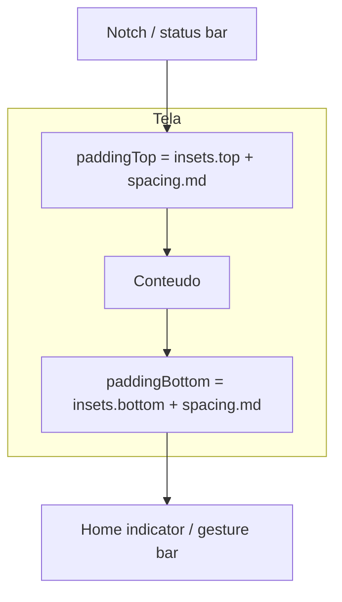
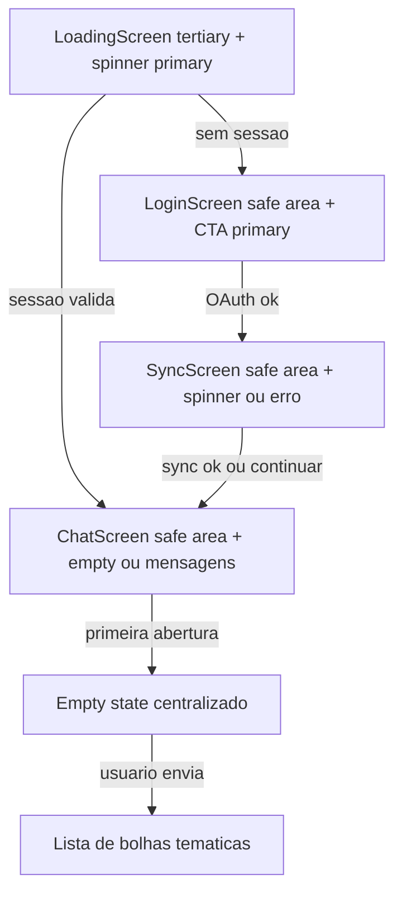

# SPEC-018 — UI/UX Mobile: Login, Chat e telas transitórias

| Campo          | Valor                                              |
|----------------|----------------------------------------------------|
| **Status**     | Draft                                              |
| **Autor**      | @convertreino                                      |
| **Revisor**    | —                                                  |
| **Criada em**  | 2026-06-19                                         |
| **Camada**     | Frontend (mobile)                                  |
| **Depende de** | SPEC-015                                           |
| **Bloqueia**   | Refino visual pós-POC, publicação nas stores      |
| **Épico**      | Conversacional                                     |

---

## Contexto

A SPEC-015 entregou os fluxos funcionais do app mobile (OAuth Strava, sync, chat com GiftedChat), mas a interface ainda usa estilos ad hoc: cores hardcoded espalhadas, fundo branco genérico e safe area inconsistente entre telas. O chat não possui empty state e o login não respeita notch nem home indicator.

Esta spec define o **design system mínimo**, regras de **safe area**, layouts e estados visuais das telas **Login**, **Loading**, **Sync** e **Chat**, alinhados à identidade visual do ConverTreino. Não altera contratos de API, auth ou comportamentos funcionais da SPEC-015 — apenas a camada de apresentação.

**Paleta de marca (fonte de verdade):**

| Token       | HEX       | RGB              | Uso principal                          |
|-------------|-----------|------------------|----------------------------------------|
| Primary     | `#FC4C02` | (252, 76, 2)     | CTA, bolha user, spinner, typing       |
| Secondary   | `#0A0908` | (10, 9, 8)       | Texto principal, títulos               |
| Tertiary    | `#F2F4F3` | (242, 244, 243)  | Fundo de tela, bolha assistant         |

Não há asset de logo no repositório — a spec assume **wordmark tipográfico** "ConverTreino" até haver imagem de marca.

---

## Escopo

### Incluído

- Design tokens centralizados (`colors`, `typography`, `spacing`, `radius`)
- Safe area top e bottom em Login, Loading, Sync e Chat (notch + home indicator)
- Empty state centralizado no chat quando `messages.length === 0`
- Tema visual do GiftedChat (bolhas, composer, banner de erro)
- Padronização visual das telas transitórias Loading e Sync
- Acessibilidade básica (contraste, alvos de toque mínimos)
- Comportamentos visuais verificáveis (CN/CB/CE de UI)
- Mapeamento spec → arquivos de implementação

### Excluído (explicitamente fora desta spec)

- Modo escuro — tema claro fixo na POC (`userInterfaceStyle: "automatic"` no Expo não implica suporte visual dark nesta spec)
- Logo/ícone de marca (PNG/SVG) — slot opcional reservado no Login
- Animações custom, haptics, gestos avançados
- Header fixo no chat, menu, logout na UI
- Redesign funcional da tela Sync (apenas padronização visual)
- Streaming, persistência de chat, features avançadas do GiftedChat (continuam excluídas na SPEC-015)
- Publicação App Store / Play Store

---

## Contrato — Design tokens

Arquivo único: [`mobile/src/theme/tokens.ts`](../mobile/src/theme/tokens.ts)

```typescript
export const colors = {
  primary: "#FC4C02",
  secondary: "#0A0908",
  tertiary: "#F2F4F3",
  onPrimary: "#FFFFFF",
  error: "#B91C1C",
  errorSurface: "#FEF2F2",
  errorBorder: "#FECACA",
  muted: "#6B7280",
  border: "#E5E7EB",
} as const;

export const spacing = {
  xs: 4,
  sm: 8,
  md: 16,
  lg: 24,
  xl: 32,
} as const;

export const radius = {
  button: 8,
  input: 8,
  bubble: 16,
} as const;

export const typography = {
  display: { fontSize: 32, fontWeight: "700" as const, color: colors.secondary },
  title: { fontSize: 20, fontWeight: "600" as const, color: colors.secondary },
  body: { fontSize: 16, fontWeight: "400" as const, color: colors.muted },
  bodyStrong: { fontSize: 16, fontWeight: "400" as const, color: colors.secondary },
  label: { fontSize: 16, fontWeight: "600" as const, color: colors.onPrimary },
  caption: { fontSize: 14, fontWeight: "400" as const, color: colors.muted },
  captionError: { fontSize: 14, fontWeight: "400" as const, color: colors.error },
} as const;

export const touchTarget = {
  minHeight: 44,
  minWidth: 44,
} as const;
```

| Regra | Detalhe |
|-------|---------|
| Fonte | System font (sem fonte custom na POC) |
| Cores nas telas | Importar de `theme/tokens.ts` — **proibido** hardcode de hex fora desse arquivo |
| Contraste | Texto `secondary` sobre `tertiary` e `onPrimary` sobre `primary` devem atender WCAG AA |
| Toque mínimo | Botões e controles interativos: mínimo **44×44 pt** |

---

## Contrato — Safe area

Regra global para **Login**, **Loading**, **Sync** e **Chat**:



| Regra | Detalhe |
|-------|---------|
| Provider | `SafeAreaProvider` em [`mobile/src/app/_layout.tsx`](../mobile/src/app/_layout.tsx) — manter |
| Implementação | `useSafeAreaInsets()` + padding no container raiz **ou** `SafeAreaView` com `edges={['top', 'bottom']}` |
| Padding extra | `spacing.md` (16px) além dos insets em top **e** bottom |
| Chat sem header | `paddingTop = insets.top + spacing.md`; `keyboardVerticalOffset = insets.top + spacing.md` |
| Chat composer | `paddingBottom = insets.bottom + spacing.md` no container externo |
| Orientação | Portrait only ([`mobile/app.config.ts`](../mobile/app.config.ts)) |

Helper sugerido (opcional, não obrigatório na POC):

```typescript
// mobile/src/theme/safeArea.ts
import { spacing } from "./tokens";

export function screenSafePadding(insets: { top: number; bottom: number }) {
  return {
    paddingTop: insets.top + spacing.md,
    paddingBottom: insets.bottom + spacing.md,
  };
}
```

---

## Contrato — Telas

### Fluxo visual



---

### Login (`mobile/src/app/(auth)/login.tsx`)

**Layout:**

```
┌─────────────────────────────┐
│      [safe area top]        │
│                             │
│        ConverTreino         │  typography.display
│   Conecte sua conta Strava  │  typography.body, center
│   para conversar sobre...   │
│                             │
│   [ erro inline se houver ] │  typography.captionError
│                             │
│  ┌─────────────────────┐    │
│  │ Conectar com Strava │    │  primary bg, min 220×44
│  └─────────────────────┘    │
│                             │
│      [safe area bottom]     │
└─────────────────────────────┘
```

| Elemento | Especificação |
|----------|---------------|
| Fundo | `colors.tertiary` |
| Container | `flex: 1`, conteúdo centralizado verticalmente entre safe areas |
| Padding horizontal | `spacing.lg` (24) |
| Título | "ConverTreino" — `typography.display` |
| Subtítulo | "Conecte sua conta Strava para conversar sobre seus treinos." — `typography.body`, `textAlign: 'center'`, `marginBottom: spacing.lg` |
| Botão primário | "Conectar com Strava" — `backgroundColor: colors.primary`, `borderRadius: radius.button`, `paddingHorizontal: spacing.lg`, `paddingVertical: 14`, `minWidth: 220`, `minHeight: touchTarget.minHeight` |
| Texto do botão | `typography.label` |
| Loading no botão | `ActivityIndicator` cor `onPrimary` + `opacity: 0.7` + `disabled` |
| Erro inline | Acima do botão — `typography.captionError`, `textAlign: 'center'`, `marginBottom: spacing.md` |

Comportamento funcional inalterado (SPEC-015): toque no botão → `login()` → transição para `syncing`.

---

### Loading (`LoadingScreen` em `mobile/src/app/_layout.tsx`)

| Elemento | Especificação |
|----------|---------------|
| Fundo | `colors.tertiary` |
| Spinner | `ActivityIndicator size="large" color={colors.primary}` |
| Texto | Nenhum (transição rápida) |
| Safe area | Top e bottom conforme contrato global |
| Alinhamento | Centralizado vertical e horizontalmente |

---

### Sync (`mobile/src/components/SyncScreen.tsx`)

Mesmo fundo (`colors.tertiary`) e safe area do Login.

| Estado | UI |
|--------|-----|
| Importando | Spinner `primary` + "Importando atividades..." — `typography.title`, `marginTop: spacing.md` |
| Erro | Título "Falha na importação" — `typography.title` |
| Erro (detalhe) | Mensagem de aviso — `typography.body`, `marginTop: spacing.sm` |
| Ação primária | "Tentar novamente" — botão filled `primary`, `radius.button` |
| Ação secundária | "Continuar mesmo assim" — texto `colors.secondary`, `fontWeight: '500'`, sem fill |

Comportamento funcional inalterado (SPEC-015 CE-6): continuar para chat após falha não-auth.

---

### Chat (`mobile/src/app/(app)/chat.tsx`)

**Sem header fixo.** Marca aparece no empty state, não em barra superior.

**Layout:**

```
┌─────────────────────────────┐
│      [safe area top]        │
│   [ banner erro opcional ]  │
│                             │
│   (empty state OU lista)    │
│                             │
│ ┌─────────────────────────┐ │
│ │ composer + send         │ │
│ └─────────────────────────┘ │
│      [safe area bottom]     │
└─────────────────────────────┘
```

#### Empty state (`messages.length === 0`)

Centralizado vertical e horizontalmente na área acima do composer.

| Elemento | Texto / estilo |
|----------|----------------|
| Título | "Pergunte sobre seus treinos" — `typography.title`, `textAlign: 'center'` |
| Subtítulo | "Experimente:" — `typography.caption`, `marginTop: spacing.md` |
| Exemplos | Bullets ou linhas separadas, `typography.body`, `textAlign: 'center'`: |
| | • "Qual foi minha corrida mais longa?" |
| | • "Quanto corri esta semana?" |

Implementação: prop `renderChatEmpty` do GiftedChat v3, ou componente dedicado [`mobile/src/components/chat/ChatEmptyState.tsx`](../mobile/src/components/chat/ChatEmptyState.tsx).

#### Bolhas de mensagem

| Remetente | Fundo | Texto | Alinhamento | Raio |
|-----------|-------|-------|-------------|------|
| User | `colors.primary` | `colors.onPrimary` | direita | `radius.bubble` |
| Assistant | `colors.tertiary` + borda `colors.border` (1px) | `colors.secondary` | esquerda | `radius.bubble` |

| Regra | Valor |
|-------|-------|
| Avatares | `renderAvatar={() => null}` (SPEC-015) |
| Timestamp | **Oculto** na POC (`renderTime={() => null}` ou estilo equivalente) |
| Nome do remetente | Oculto na POC |

#### Composer (GiftedChat)

| Elemento | Valor |
|----------|-------|
| Placeholder | "Pergunte sobre seus treinos..." |
| Fundo input | `#FFFFFF` com borda `colors.border` (1px) |
| Fundo área de mensagens | `colors.tertiary` |
| Botão enviar | Cor `colors.primary`; visível apenas com texto (`isSendButtonAlwaysVisible: false`) |
| Locale | `"pt-br"` (dayjs) |

#### Banner de erro

Posicionado no topo do container, **abaixo** do safe top padding.

| Propriedade | Valor |
|-------------|-------|
| Fundo | `colors.errorSurface` |
| Borda inferior | `colors.errorBorder`, 1px |
| Padding | `paddingHorizontal: spacing.md`, `paddingVertical: 10` |
| Texto | `typography.captionError`, `textAlign: 'center'` |

Mensagens de erro seguem CE-3/CE-5 da SPEC-015 (502, rede, etc.).

#### Typing indicator

| Prop | Valor |
|------|-------|
| `isTyping` | `true` enquanto aguarda `POST /chat/messages` |
| Label | Nativo do GiftedChat em português via `locale="pt-br"` |

---

## Contrato — GiftedChat (props e customização)

Base funcional da SPEC-015 preservada. Adições visuais desta spec:

```typescript
import { GiftedChat } from "react-native-gifted-chat";
import "dayjs/locale/pt-br";
import { colors, radius, spacing } from "@/theme/tokens";

const keyboardVerticalOffset = insets.top + spacing.md;

<GiftedChat
  messages={messages}
  onSend={handleSend}
  user={giftedChatUsers.user}
  isTyping={isLoading}
  locale="pt-br"
  isSendButtonAlwaysVisible={false}
  renderAvatar={() => null}
  renderTime={() => null}
  renderChatEmpty={() => <ChatEmptyState />}
  messagesContainerStyle={{
    backgroundColor: colors.tertiary,
    paddingTop: spacing.sm,
  }}
  textInputProps={{
    placeholder: "Pergunte sobre seus treinos...",
    placeholderTextColor: colors.muted,
    style: {
      backgroundColor: "#FFFFFF",
      borderWidth: 1,
      borderColor: colors.border,
      borderRadius: radius.input,
      paddingHorizontal: spacing.md,
      paddingVertical: spacing.sm,
      color: colors.secondary,
    },
  }}
  renderBubble={(props) => (
    <Bubble
      {...props}
      wrapperStyle={{
        right: {
          backgroundColor: colors.primary,
          borderRadius: radius.bubble,
        },
        left: {
          backgroundColor: colors.tertiary,
          borderWidth: 1,
          borderColor: colors.border,
          borderRadius: radius.bubble,
        },
      }}
      textStyle={{
        right: { color: colors.onPrimary },
        left: { color: colors.secondary },
      }}
    />
  )}
  keyboardAvoidingViewProps={{ keyboardVerticalOffset }}
/>
```

| Prop | Obrigatória | Valor / regra |
|------|-------------|---------------|
| `user` | Sim | `{ _id: USER_GIFTED_ID }` (SPEC-015) |
| `isTyping` | Sim | `true` durante request |
| `locale` | Sim | `"pt-br"` |
| `renderAvatar` | Sim | `() => null` |
| `renderTime` | Sim | `() => null` — timestamp oculto |
| `isSendButtonAlwaysVisible` | Sim | `false` |
| `disableKeyboardProvider` | Sim | `true` — provider na raiz |
| `renderChatEmpty` | Sim | Empty state centralizado quando sem mensagens |
| `messagesContainerStyle` | Sim | Fundo `colors.tertiary` |
| `renderBubble` | Sim | Bolhas user/assistant conforme tabela acima |
| `textInputProps` | Sim | Placeholder e estilo do input |
| `keyboardAvoidingViewProps` | Sim | `{ keyboardVerticalOffset: insets.top + spacing.md }` |

Container externo do ChatScreen:

```typescript
<View
  style={[
    styles.container,
    {
      backgroundColor: colors.tertiary,
      paddingTop: insets.top + spacing.md,
      paddingBottom: insets.bottom + spacing.md,
    },
  ]}
>
```

---

## Contrato — Componentes reutilizáveis

### `PrimaryButton`

| Prop | Tipo | Descrição |
|------|------|-----------|
| `label` | `string` | Texto do botão |
| `onPress` | `() => void` | Ação |
| `loading` | `boolean` | Exibe spinner e desabilita |
| `disabled` | `boolean` | Opacidade reduzida |

Estilo: `colors.primary`, `radius.button`, `touchTarget.minHeight`, `typography.label`.

Opcional na POC — Login e Sync podem manter `Pressable` inline desde que respeitem tokens.

### `ChatEmptyState`

Componente puro de apresentação; sem lógica de negócio.

| Prop | Tipo | Default |
|------|------|---------|
| `title` | `string` | `"Pergunte sobre seus treinos"` |
| `examples` | `string[]` | Ver empty state acima |

---

## Comportamentos

### Casos normais (Happy Path)

#### CN-UI-1: Login exibe identidade visual e safe area
**Dado** que o app está em estado `unauthenticated`  
**Quando** a tela Login é renderizada  
**Então** o fundo é `colors.tertiary`  
**E** o título "ConverTreino" usa `typography.display`  
**E** o botão "Conectar com Strava" usa `colors.primary`  
**E** o conteúdo respeita `paddingTop >= insets.top + 16` e `paddingBottom >= insets.bottom + 16`

#### CN-UI-2: Chat exibe empty state na primeira abertura
**Dado** que o usuário está autenticado  
**E** `messages.length === 0`  
**Quando** a tela Chat é renderizada  
**Então** o empty state centralizado é visível com título e exemplos  
**E** o composer permanece acessível na parte inferior  
**E** nenhum header fixo é exibido

#### CN-UI-3: Bolhas seguem paleta após envio
**Dado** que CN-UI-2 aplicou  
**Quando** o usuário envia uma mensagem e recebe resposta  
**Então** a bolha `user` tem fundo `primary` e texto `onPrimary`  
**E** a bolha `assistant` tem fundo `tertiary` com borda `border` e texto `secondary`  
**E** o empty state deixa de ser exibido

#### CN-UI-4: Loading e Sync usam tokens consistentes
**Dado** transição pós-login ou cold start  
**Quando** Loading ou Sync são exibidos  
**Então** fundo `tertiary`, spinner `primary`  
**E** safe area top/bottom aplicada

### Casos de borda (Edge Cases)

#### CB-UI-1: Empty state some com histórico em memória
**Dado** que o usuário enviou ao menos uma mensagem na sessão  
**Quando** `messages.length > 0`  
**Então** `renderChatEmpty` não é exibido  
**E** a lista de mensagens ocupa a área central

#### CB-UI-2: Banner de erro não cobre composer
**Dado** que ocorreu erro de rede ou 502 no chat  
**Quando** o banner de erro é exibido  
**Então** o composer permanece visível e utilizável abaixo da lista  
**E** o banner usa `errorSurface` / `errorBorder` / `error`

#### CB-UI-3: Teclado aberto respeita safe area
**Dado** que o usuário foca o input do chat  
**Quando** o teclado virtual abre  
**Então** o composer sobe acima do teclado (`keyboardAvoidingViewProps`)  
**E** o offset considera `insets.top + spacing.md`

### Casos de erro (visuais)

#### CE-UI-1: Erro OAuth no Login
**Dado** falha no OAuth (SPEC-015 CE-1)  
**Quando** a mensagem de erro é exibida  
**Então** usa `typography.captionError` acima do botão primário  
**E** o layout mantém safe area intacta

#### CE-UI-2: Botão desabilitado durante loading
**Dado** que o usuário tocou "Conectar com Strava"  
**Quando** `loading === true`  
**Então** o botão exibe spinner branco  
**E** opacidade 0.7 e `disabled` impedem double-tap

---

## Acessibilidade

| Requisito | Regra |
|-----------|-------|
| Contraste | `secondary` sobre `tertiary`: OK; `onPrimary` sobre `primary`: OK |
| Toque | Botões e área de enviar: mínimo 44×44 pt |
| Labels | Botão Login: `accessibilityLabel="Conectar com Strava"` |
| Erros | Banner e mensagens inline anunciáveis por leitor de tela (`accessibilityRole="alert"` no banner) |
| Placeholder | Não substituir label acessível do input — placeholder é complementar |

---

## Critérios de Aceite

- [ ] Spec com status **Draft** em `specs/SPEC-018-mobile-ui-ux.md`
- [ ] `mobile/src/theme/tokens.ts` exporta `colors`, `spacing`, `radius`, `typography`, `touchTarget`
- [ ] Login, Loading, Sync e Chat aplicam safe area top **e** bottom com padding extra de 16px
- [ ] Fundo das quatro telas usa `colors.tertiary` (`#F2F4F3`)
- [ ] Botões primários usam `colors.primary` (`#FC4C02`) e texto `onPrimary`
- [ ] Chat exibe empty state centralizado quando `messages.length === 0`
- [ ] Bolhas user/assistant seguem cores e raios documentados
- [ ] Banner de erro do chat usa `errorSurface`, `errorBorder`, `error`
- [ ] Nenhuma cor hardcoded fora de `theme/tokens.ts` nas telas escopo
- [ ] GiftedChat configurado conforme tabela de props desta spec
- [ ] Testes existentes passam; teste de empty state adicionado em `chat.test.tsx`
- [ ] Não contradiz fluxos funcionais da SPEC-015

---

## Mapeamento Spec → Implementação

| Artefato spec | Arquivo alvo | Observação |
|---------------|--------------|------------|
| Design tokens | [`mobile/src/theme/tokens.ts`](../mobile/src/theme/tokens.ts) | Novo |
| Safe area helper | [`mobile/src/theme/safeArea.ts`](../mobile/src/theme/safeArea.ts) | Opcional |
| Login | [`mobile/src/app/(auth)/login.tsx`](../mobile/src/app/(auth)/login.tsx) | Safe area + tokens |
| Chat | [`mobile/src/app/(app)/chat.tsx`](../mobile/src/app/(app)/chat.tsx) | GiftedChat tema + banner |
| Empty state | [`mobile/src/components/chat/ChatEmptyState.tsx`](../mobile/src/components/chat/ChatEmptyState.tsx) | Novo (recomendado) |
| Loading | [`mobile/src/app/_layout.tsx`](../mobile/src/app/_layout.tsx) | `LoadingScreen` |
| Sync | [`mobile/src/components/SyncScreen.tsx`](../mobile/src/components/SyncScreen.tsx) | Tokens + safe area |
| Teste Login | [`mobile/src/app/(auth)/__tests__/login.test.tsx`](../mobile/src/app/(auth)/__tests__/login.test.tsx) | Regressão CN-1 |
| Teste Chat | [`mobile/src/app/(app)/__tests__/chat.test.tsx`](../mobile/src/app/(app)/__tests__/chat.test.tsx) | + CN-UI-2 empty state |

---

## Decisões de Design

### Decisão: Spec visual separada da SPEC-015
**Contexto:** SPEC-015 mistura contratos funcionais com detalhes mínimos de UI.  
**Opção escolhida:** SPEC-018 dedicada a tokens, layout e estados visuais.  
**Alternativas rejeitadas:** Expandir SPEC-015 com seção de design.  
**Motivo:** Separação de concerns; revisão visual independente.

### Decisão: Tema claro único
**Contexto:** Paleta fornecida define identidade em fundo claro (`tertiary`).  
**Opção escolhida:** Tema claro fixo na POC; dark mode fora de escopo.  
**Alternativas rejeitadas:** Suporte dark com inversão de secondary/tertiary.  
**Motivo:** Escopo mínimo; `userInterfaceStyle: automatic` não exige dark nesta fase.

### Decisão: Chat full-screen sem header
**Contexto:** Header fixo vs imersão total no chat.  
**Opção escolhida:** Sem header; marca no empty state.  
**Alternativas rejeitadas:** Header com título "ConverTreino".  
**Motivo:** Decisão de produto confirmada; maximiza área útil para mensagens.

### Decisão: Empty state centralizado
**Contexto:** Primeira impressão do chat sem histórico.  
**Opção escolhida:** Título + exemplos de perguntas via `renderChatEmpty`.  
**Alternativas rejeitadas:** Lista vazia sem orientação; header substituindo empty state.  
**Motivo:** Onboarding conversacional leve sem tutorial multi-step.

### Decisão: Fundo tertiary em todas as telas
**Contexto:** POC atual usa `#ffffff` genérico.  
**Opção escolhida:** `colors.tertiary` como fundo de tela; branco reservado ao input.  
**Alternativas rejeitadas:** Fundo branco com accent laranja apenas no CTA.  
**Motivo:** Consistência de marca; secondary legível sobre tertiary.

### Decisão: Tokens centralizados
**Contexto:** Cores espalhadas (`#fc4c02`, `#FC4C02`, `#111827`, etc.).  
**Opção escolhida:** `theme/tokens.ts` como única fonte.  
**Alternativas rejeitadas:** Constantes por tela.  
**Motivo:** Manutenção e critério de aceite verificável.

### Decisão: Timestamp oculto no chat
**Contexto:** GiftedChat exibe horário por padrão.  
**Opção escolhida:** `renderTime={() => null}` na POC.  
**Alternativas rejeitadas:** Timestamp em `caption` muted.  
**Motivo:** Interface mais limpa; histórico sem persistência temporal relevante.

### Decisão: Telas transitórias incluídas
**Contexto:** Loading e Sync fazem parte do fluxo visual pós-login.  
**Opção escolhida:** Mesmos tokens e safe area que Login/Chat.  
**Alternativas rejeitadas:** Escopo estrito só Login + Chat.  
**Motivo:** Consistência percebida no primeiro uso.

---

## Notas de Migração

- Implementação visual é **não-breaking** para API e auth — apenas refactor de estilos
- Substituir hex hardcoded por imports de `@/theme/tokens`
- Adicionar `useSafeAreaInsets` em Login e Sync (Chat e Loading parcialmente cobertos)
- GiftedChat: importar `Bubble` de `react-native-gifted-chat` se usar `renderBubble`
- Rollback: reverter arquivos de UI — sem impacto em backend ou SecureStore

---

## Checklist de revisão

### Clareza
- [ ] Tokens com valores hex explícitos e uso documentado
- [ ] Cada tela tem wireframe ASCII e tabela de elementos
- [ ] Props GiftedChat listadas com obrigatoriedade

### Completude
- [ ] Safe area top e bottom em todas as telas escopo
- [ ] Empty state, bolhas, composer, banner e typing cobertos
- [ ] CN/CB/CE de UI documentados

### Consistência
- [ ] Paleta alinhada aos valores fornecidos pelo produto
- [ ] Não contradiz SPEC-015 (fluxos, GiftedChat base, locale pt-br)
- [ ] Critérios de aceite binários e verificáveis

### Testabilidade
- [ ] Mapeamento spec → arquivos e testes
- [ ] Empty state testável via `renderChatEmpty` mock
