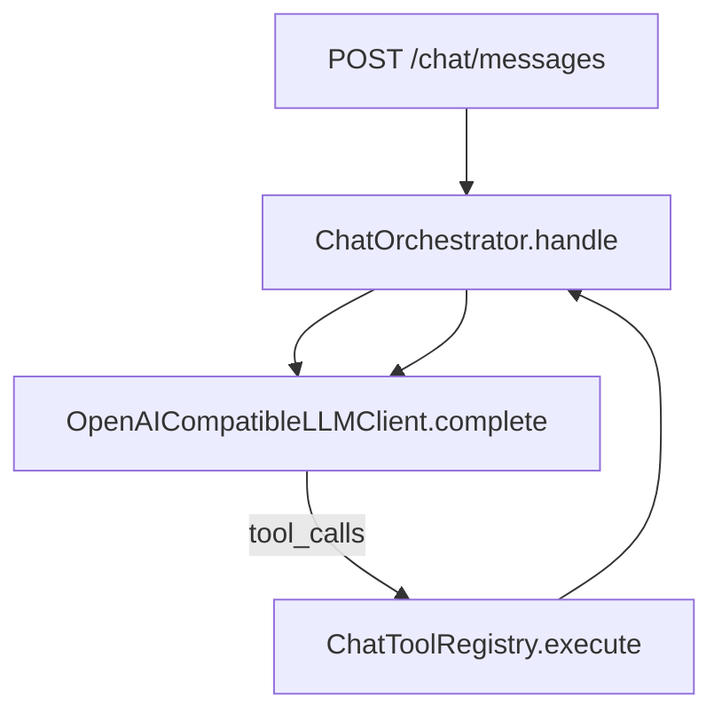
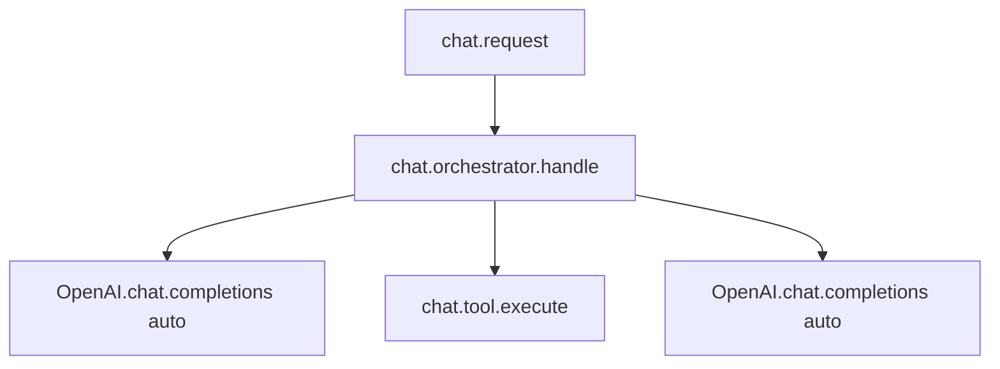

# SPEC-019 — Arize Phoenix para debug local (Docker)

| Campo          | Valor                                              |
|----------------|----------------------------------------------------|
| **Status**     | Draft                                              |
| **Autor**      | @convertreino                                      |
| **Revisor**    | —                                                  |
| **Criada em**  | 2026-06-22                                         |
| **Camada**     | Infra (Docker) + Application (tracing)             |
| **Depende de** | SPEC-014 (chat API), SPEC-017 (Groq LLM)           |
| **Bloqueia**   | —                                                  |
| **Épico**      | Observabilidade / DevEx                            |

---

## Contexto

O ConverTreino não possui observabilidade de LLM. Debug do fluxo conversacional exige reproduzir manualmente requests ou inspecionar logs genéricos. O loop crítico passa por `POST /chat/messages` → `ChatOrchestrator` → `OpenAICompatibleLLMClient` → `ChatToolRegistry`, com múltiplas iterações tool-use.

[Arize Phoenix](https://arize.com/docs/phoenix) é uma plataforma open-source de observabilidade para aplicações LLM, baseada em OpenInference (extensão OTel para IA). Para dev local, Phoenix roda via Docker e expõe UI em `http://localhost:6006`, coletando traces via OTLP HTTP (`/v1/traces`) ou gRPC (`4317`).



Pontos de hook existentes:
- `api/routes/chat.py`
- `application/chat_orchestrator.py`
- `application/llm/openai_client.py` (auto-instrumentação OpenAI SDK)
- `application/chat_tools.py`

---

## Escopo

### Incluído

**1. Docker Compose — profile `observability`**

Serviço `phoenix` em `backend/docker-compose.yml` com profile opcional:

| Serviço | Profile | Portas | Imagem |
|---|---|---|---|
| `postgres` | (default) | 5432 | `postgres:16-alpine` |
| `phoenix` | `observability` | 6006 (UI + OTLP HTTP), 4317 (OTLP gRPC) | `arizephoenix/phoenix:latest` |

Comandos:

```bash
cd backend
docker compose up -d                              # só Postgres (comportamento atual)
docker compose --profile observability up -d      # Postgres + Phoenix
```

Sem volume persistente na v1 — SQLite interno do Phoenix; traces resetam ao recriar o container.

**2. Dependências Python (extra `observability`)**

```toml
[project.optional-dependencies]
observability = [
    "arize-phoenix-otel>=0.9.0",
    "openinference-instrumentation-openai>=0.1.30",
    "opentelemetry-api>=1.31.0",
]
```

Instalação: `uv sync --extra observability --dev`

**3. Configuração via env vars**

| Variável | Obrigatória | Default | Descrição |
|---|---|---|---|
| `PHOENIX_ENABLED` | Não | `false` | Liga export de traces |
| `PHOENIX_COLLECTOR_ENDPOINT` | Não | `http://localhost:6006/v1/traces` | OTLP HTTP endpoint |
| `PHOENIX_PROJECT_NAME` | Não | `convertreino-dev` | Projeto no UI Phoenix |

Regras:
- Desligado por default — CI, pytest e produção não enviam traces
- pytest / `PYTEST_CURRENT_TEST` → força `enabled=false`
- Collector inacessível → log warning; app continua (fail-open)
- Pacotes ausentes → log warning com instrução `uv sync --extra observability`

**4. Bootstrap de tracing**

Módulo `infrastructure/phoenix_tracing.py`:
- `setup_phoenix_tracing(settings: PhoenixSettings) -> bool` — idempotente, chamado no `lifespan` de `api/main.py`
- `register(project_name=..., endpoint=...)` via `arize-phoenix-otel`
- `OpenAIInstrumentor().instrument(tracer_provider=...)` para spans automáticos de `chat.completions.create` (OpenAI **e** Groq)

**5. Spans manuais — loop completo**

Helper `infrastructure/tracing.py` com `get_tracer()`, `truncate_attr()` e utilitários.

| Span | Onde | Atributos |
|---|---|---|
| `chat.request` | rota `POST /chat/messages` | `chat.user_id`, `chat.message_count`, `chat.tool_calls_made` |
| `chat.orchestrator.handle` | `ChatOrchestrator.handle` | `chat.max_tool_iterations`, `chat.iterations`, `chat.tool_calls_made` |
| `chat.tool.execute` | `ChatToolRegistry.execute` | `tool.name`, `tool.arguments`, `tool.result` (truncado em 4 KB) |
| LLM calls | auto via OpenAIInstrumentor | prompt, completion, tokens, model, latency |

Hierarquia:



**6. Documentação**

Seção "Debug com Phoenix" em `backend/README.md` e vars em `.env.example`.

Smoke test manual sugerido:
1. "Qual foi minha corrida mais longa?" (tool `get_longest_run`)
2. "Quanto corri essa semana?" (tool `get_run_volume`)
3. "Olá!" (sem tool)

### Excluído (explicitamente fora desta spec)

- Phoenix Cloud / Arize AX (produção)
- Persistência PostgreSQL do Phoenix
- Backend rodando em container
- Instrumentação FastMCP (`/mcp`)
- Evals, datasets, prompt playground no Phoenix
- Redaction/masking avançado de PII
- Alteração de contrato da API de chat
- Testes E2E com Phoenix real no CI

---

## Contrato

### `PhoenixSettings`

```python
@dataclass(frozen=True, slots=True)
class PhoenixSettings:
    enabled: bool
    collector_endpoint: str
    project_name: str

def get_phoenix_settings() -> PhoenixSettings: ...
```

### Bootstrap

```python
def setup_phoenix_tracing(settings: PhoenixSettings) -> bool:
    """Retorna True se tracing foi registrado."""
```

### Comportamento em runtime

| Cenário | Comportamento |
|---|---|
| `PHOENIX_ENABLED=false` | No-op; spans manuais usam NoOpTracer |
| pytest / `PYTEST_CURRENT_TEST` set | No-op (mesmo se env=true) |
| enabled + collector OK | Traces visíveis no UI |
| enabled + collector down | Warning log; chat funciona |
| enabled + pacotes ausentes | Warning log; chat funciona |

---

## Comportamentos

### Casos normais (Happy Path)

#### CN-1: Phoenix habilitado com collector acessível
**Dado** que `docker compose --profile observability up -d` está rodando  
**E** `PHOENIX_ENABLED=true` com extras instalados  
**Quando** um request `POST /chat/messages` é processado  
**Então** traces aparecem em `http://localhost:6006` com spans `chat.request`, `chat.orchestrator.handle`, LLM e tools

#### CN-2: Phoenix desabilitado (default)
**Dado** que `PHOENIX_ENABLED` está ausente ou `false`  
**Quando** a API inicia e processa chat  
**Então** nenhum trace é exportado  
**E** o chat funciona normalmente

#### CN-3: Auto-instrumentação cobre OpenAI e Groq
**Dado** que Phoenix está habilitado  
**Quando** `LLM_PROVIDER=groq` ou `openai`  
**Então** spans de LLM são capturados via OpenAI SDK instrumentor

### Casos de borda (Edge Cases)

#### CB-1: `PHOENIX_ENABLED` case-insensitive
**Dado** que `PHOENIX_ENABLED=TRUE`  
**Quando** `get_phoenix_settings()` é invocado fora de pytest  
**Então** `enabled=True`

#### CB-2: Resultado de tool truncado
**Dado** que uma tool retorna payload > 4 KB  
**Quando** o span `chat.tool.execute` registra `tool.result`  
**Então** o atributo é truncado com sufixo `...`

### Casos de erro

#### CE-1: Collector indisponível
**Dado** que `PHOENIX_ENABLED=true` mas Phoenix não está rodando  
**Quando** `setup_phoenix_tracing` é invocado  
**Então** log warning é emitido  
**E** a API inicia normalmente

#### CE-2: Pacotes observability não instalados
**Dado** que `PHOENIX_ENABLED=true` sem `uv sync --extra observability`  
**Quando** `setup_phoenix_tracing` é invocado  
**Então** log warning indica comando de instalação  
**E** a API inicia normalmente

---

## Critérios de Aceite

- [ ] Serviço `phoenix` no compose com profile `observability`; Postgres inalterado sem profile
- [ ] `PHOENIX_ENABLED` controla export; default `false`
- [ ] Auto-instrumentação OpenAI SDK captura chamadas LLM (OpenAI e Groq)
- [ ] Spans manuais cobrem request HTTP, orchestrator e execução de tools
- [ ] pytest/CI não enviam traces e não exigem Phoenix rodando
- [ ] README documenta fluxo completo de debug local
- [ ] `.env.example` atualizado
- [ ] Testes unitários para `get_phoenix_settings()` e no-op quando disabled
- [ ] Nenhuma migration; nenhuma alteração no mobile

---

## Mapeamento Spec → Testes

| Artefato | Localização |
|---|---|
| Settings + parsing env | `backend/tests/unit/infrastructure/test_phoenix_settings.py` |
| Bootstrap no-op quando disabled | `backend/tests/unit/infrastructure/test_phoenix_tracing.py` |
| Orchestrator (sem regressão) | `backend/tests/unit/application/test_chat_orchestrator.py` (existente) |
| Integração chat | `backend/tests/integration/test_chat_messages.py` (sem Phoenix; inalterado) |

---

## Decisões de Design

### Decisão: profile Compose em vez de serviço always-on
**Contexto:** Como subir Phoenix sem alterar o fluxo default de dev.  
**Opção escolhida:** Profile `observability` no docker-compose.  
**Alternativas rejeitadas:** Serviço always-on; arquivo compose separado.  
**Motivo:** Preserva `docker compose up -d` (só Postgres); Phoenix é opt-in explícito.

### Decisão: auto-instrument OpenAI + spans manuais no orchestrator/tools
**Contexto:** O que instrumentar na v1.  
**Opção escolhida:** OpenInference para LLM + spans OTel manuais no loop tool-use.  
**Alternativas rejeitadas:** Apenas auto-instrument LLM; spans manuais em todo lugar.  
**Motivo:** OpenInference cobre prompts/tokens; spans manuais expõem o diferencial do ConverTreino (tool loop).

### Decisão: fail-open no collector
**Contexto:** Comportamento quando Phoenix não está disponível.  
**Opção escolhida:** Warning log; chat continua.  
**Alternativas rejeitadas:** Fail-fast na startup.  
**Motivo:** Debug local não deve quebrar o chat.

### Decisão: extras opcionais `observability`
**Contexto:** Onde declarar dependências Phoenix.  
**Opção escolhida:** `[project.optional-dependencies] observability`.  
**Alternativas rejeitadas:** Dependência de produção.  
**Motivo:** Zero impacto em CI/deploy; dev instala sob demanda.

### Decisão: desabilitar automaticamente em pytest
**Contexto:** Evitar flakes e poluição de traces nos testes.  
**Opção escolhida:** `get_phoenix_settings()` força `enabled=false` em runtime de teste.  
**Motivo:** Testes não devem depender de container Phoenix.

---

## Guia de uso

```bash
cd backend
docker compose --profile observability up -d
uv sync --extra observability --dev
```

`.env`:

```env
PHOENIX_ENABLED=true
# PHOENIX_COLLECTOR_ENDPOINT=http://localhost:6006/v1/traces
# PHOENIX_PROJECT_NAME=convertreino-dev
```

Subir API e inspecionar traces:

```bash
uv run uvicorn convertreino.api.main:app --reload --app-dir src
open http://localhost:6006
```

---

## Notas de Segurança

- Phoenix local é **somente para desenvolvimento** — não habilitar `PHOENIX_ENABLED` em produção
- Traces podem conter prompts e respostas do usuário — usar apenas em ambiente local confiável

---

## Checklist de revisão

### Clareza
- [x] Contexto explica o problema sem prescrever implementação detalhada
- [x] Contrato com tipos explícitos
- [x] Comportamentos com Dado/Quando/Então
- [x] Critérios de aceite binários

### Completude
- [x] Casos normais, borda e erro
- [x] Escopo excluído explícito

### Consistência
- [x] Não altera contrato HTTP de chat (SPEC-014)
- [x] Compatível com providers OpenAI e Groq (SPEC-017)
- [x] Spans manuais não alteram `LLMClient` nem `ChatResponse`

### Testabilidade
- [x] Settings e bootstrap testáveis sem Phoenix rodando
- [x] Integração existente inalterada
