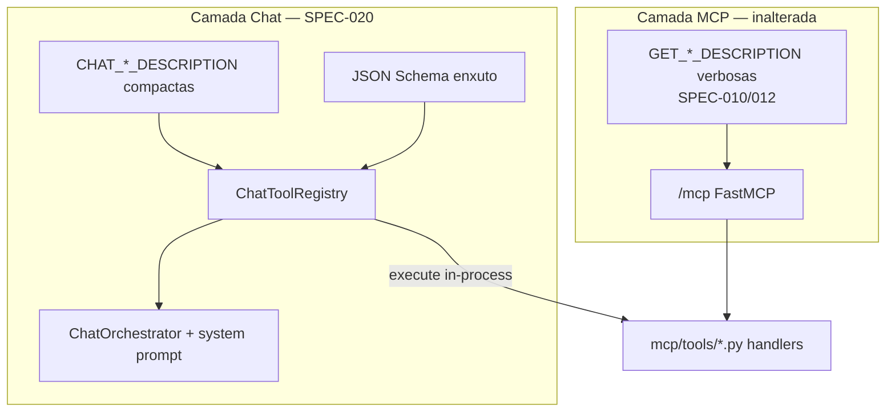
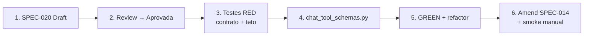

# SPEC-020 — Engenharia de Prompt: Compactação de Schemas de Tools no Chat

| Campo          | Valor                                              |
|----------------|----------------------------------------------------|
| **Status**     | Draft                                              |
| **Autor**      | @convertreino                                      |
| **Revisor**    | —                                                  |
| **Criada em**  | 2026-06-23                                         |
| **Camada**     | Application                                        |
| **Depende de** | SPEC-014, SPEC-010, SPEC-012, SPEC-017             |
| **Bloqueia**   | —                                                  |
| **Épico**      | Conversacional / Engenharia de Prompt                |

---

## Contexto

O `ChatToolRegistry` (`application/chat_tools.py`) monta as `ToolDefinition` enviadas ao LLM em cada chamada `LLMClient.complete(..., tools=...)`. Hoje ele reutiliza **verbatim** as constantes MCP (`GET_LONGEST_RUN_DESCRIPTION`, `GET_LONGEST_RIDE_DESCRIPTION`, `GET_RUN_VOLUME_DESCRIPTION`, `GET_RIDE_VOLUME_DESCRIPTION`), cada uma com **~1.400–1.600 caracteres**, incluindo:

- Listas de perguntas exemplo e anti-exemplos
- Tabelas de conversão de intenção → `start_date` / `end_date`
- Orientações de período relativo ("essa semana", "em 2024", etc.)

Essa verbosidade é **intencional e correta** para o transporte MCP/FastMCP (SPEC-010, SPEC-012): desenvolvedores e clientes MCP não compartilham o system prompt do chat.

No fluxo conversacional, porém, o mesmo conteúdo é redundante porque:

- `DEFAULT_SYSTEM_PROMPT` em `chat_orchestrator.py` já orienta distinção Run/Ride, recorde individual vs volume agregado e conversão de períodos para ISO 8601 UTC.
- `_build_system_prompt()` injeta a **data/hora UTC atual** e os bounds concretos de `'essa semana'` e `'semana passada'` a cada request.

**Problema:** alto consumo de tokens em toda iteração do loop tool-use, sem ganho proporcional de acurácia — o LLM recebe a mesma informação três vezes (system prompt fixo, bloco temporal dinâmico e quatro descrições verbosas).



Esta spec formaliza a **separação de contratos**: MCP permanece verboso; chat passa a usar descrições e schema compactos dedicados na camada Application.

---

## Escopo

### Incluído

- Novo módulo `application/llm/chat_tool_schemas.py` com:
  - `CHAT_GET_LONGEST_RUN_DESCRIPTION`, `CHAT_GET_LONGEST_RIDE_DESCRIPTION`, `CHAT_GET_RUN_VOLUME_DESCRIPTION`, `CHAT_GET_RIDE_VOLUME_DESCRIPTION` — uma constante compacta por tool (4 tools)
  - `CHAT_DATE_PARAMS_SCHEMA` — JSON Schema minificado compartilhado
  - Helper opcional `get_chat_tool_definitions() -> list[ToolDefinition]` **ou** montagem em `ChatToolRegistry` importando as constantes (decisão de implementação)
- Alteração de `application/chat_tools.py`:
  - **Parar de importar** `GET_*_DESCRIPTION` do MCP
  - Usar constantes compactas e `CHAT_DATE_PARAMS_SCHEMA`
  - Manter `execute()` e assinaturas públicas inalteradas (SPEC-014)
- Critérios estruturais do contrato compacto (seção Contrato)
- Metas mensuráveis de tamanho (caracteres) verificáveis em teste unitário
- Matriz de intenções adaptada de SPEC-010/012 como critério de acurácia manual/nightly
- Atualização de `backend/tests/unit/application/test_chat_tools.py`: substituir `test_tool_definitions_reuse_mcp_descriptions` por testes de contrato compacto
- Novo arquivo de testes `backend/tests/unit/application/test_chat_tool_schemas.py` (recomendado) para contrato + teto de tamanho
- Amend pontual em `specs/SPEC-014-chat-api.md` (1 parágrafo): chat deixa de reutilizar descrições MCP verbatim — superseded parcialmente por esta spec

### Excluído (explicitamente fora desta spec)

- Alteração de `GET_*_DESCRIPTION` em `mcp/tools/pr.py` e `mcp/tools/volume.py`
- Alteração de testes MCP (`backend/tests/unit/mcp/test_server.py`) — continuam assertando descrições verbosas
- Contrato HTTP `POST /chat/messages` (SPEC-014)
- `period_resolver` server-side (roadmap SPEC-016+)
- Mudança de nomes de tools ou parâmetros (`start_date`, `end_date`)
- Testes E2E com LLM real no CI de PR (padrão SPEC-014/017); eval de acurácia automatizada em SPEC-021 (nightly)
- Alteração do loop tool-use, providers LLM ou tracing Phoenix (SPEC-017/019)
- Dependência `tiktoken` ou métricas por modelo

---

## Contrato

### Princípio de compactação

Cada `ToolDefinition` enviada ao LLM deve conter **apenas o contrato mínimo**:

1. **Propósito** — recorde individual vs volume agregado
2. **Sport type** — `Run` vs `Ride`
3. **Parâmetros opcionais** — `start_date`, `end_date` sem prosa redundante no schema
4. **Fronteira em uma linha** — qual tool irmã **não** usar

**Removido em relação ao MCP:** listas de perguntas exemplo, anti-exemplos extensos, tabelas de conversão de datas (já cobertas pelo system prompt dinâmico).

### Descrições compactas

| Tool | Constante | Descrição compacta |
|------|-----------|-------------------|
| `get_longest_run` | `CHAT_GET_LONGEST_RUN_DESCRIPTION` | Recorde de corrida (Run): atividade individual com maior distância. Filtro opcional por `start_date`/`end_date` ISO 8601 UTC. Não usar para Ride, volume agregado ou pace. |
| `get_longest_ride` | `CHAT_GET_LONGEST_RIDE_DESCRIPTION` | Recorde de pedal (Ride): atividade individual com maior distância. Filtro opcional por datas ISO 8601 UTC. Não usar para Run, volume agregado ou velocidade média. |
| `get_run_volume` | `CHAT_GET_RUN_VOLUME_DESCRIPTION` | Volume agregado de corrida (Run): soma de km e contagem de atividades. Filtro opcional por datas ISO 8601 UTC. Não usar para recorde individual, Ride ou pace. |
| `get_ride_volume` | `CHAT_GET_RIDE_VOLUME_DESCRIPTION` | Volume agregado de pedal (Ride): soma de km e contagem de atividades. Filtro opcional por datas ISO 8601 UTC. Não usar para recorde individual, Run ou velocidade média. |

Cada descrição deve ter entre **120 e 180 caracteres** (orientação de redação; o teto agregado abaixo é o critério normativo).

### JSON Schema enxuto

Substituir `_DATE_PARAMS_SCHEMA` atual (que repete "ISO 8601 UTC" em cada property) por schema minificado:

```python
CHAT_DATE_PARAMS_SCHEMA: dict[str, Any] = {
    "type": "object",
    "properties": {
        "start_date": {"type": "string"},
        "end_date": {"type": "string"},
    },
    "additionalProperties": False,
}
```

### Divisão de responsabilidades: tool vs system prompt

| Responsabilidade | Onde vive | Exemplos |
|------------------|-----------|----------|
| Persona, idioma, proibição de inventar números | `DEFAULT_SYSTEM_PROMPT` | "Responda em português do Brasil" |
| Distinção recorde vs volume; Run vs Ride | `DEFAULT_SYSTEM_PROMPT` | `get_longest_run` vs `get_run_volume` |
| Regra geral de conversão de períodos para ISO 8601 UTC | `DEFAULT_SYSTEM_PROMPT` | "Converta períodos mencionados..." |
| Data/hora UTC atual; bounds de "essa semana" / "semana passada" | `_build_system_prompt()` (dinâmico) | Instantes concretos injetados por request |
| Propósito específico da tool; sport type; fronteira com tool irmã | `CHAT_*_DESCRIPTION` | "Não usar para Ride, volume agregado..." |
| Tipos dos parâmetros opcionais | `CHAT_DATE_PARAMS_SCHEMA` | `start_date` / `end_date` como `string` |

O LLM **não** recebe `user_id` em nenhum schema de chat (inalterado — SPEC-014).

### Assinatura pública (sem mudança)

`ChatToolRegistry.get_tool_definitions() -> list[ToolDefinition]` e `ChatToolRegistry.execute(user_id, tool_name, arguments)` mantêm assinaturas da SPEC-014; apenas o **conteúdo** das `ToolDefinition` muda.

### Meta de tamanho (critério mensurável)

Metas verificáveis em teste unitário (serialização JSON minificada com `separators=(",", ":")`):

| Métrica | Teto SPEC-020 |
|---------|---------------|
| Chars totais das 4 descrições | ≤ 800 |
| Chars do schema JSON serializado (uma cópia) | ≤ 120 |
| Chars totais do payload `tools` (4 defs completas: name + description + parameters) | ≤ 1.000 |

A spec fixa o **teto**, não o baseline. O baseline atual (~6.000 chars nas descrições, ~6.300 no payload total) serve apenas como referência de implementação (~87% de redução esperada).

---

## Comportamentos

### Casos normais (Happy Path)

#### CN-1: Tool definitions usam contrato compacto
**Dado** um `ChatToolRegistry` instanciado  
**Quando** `get_tool_definitions()` é invocado  
**Então** retorna 4 tools com descrições das constantes `CHAT_*_DESCRIPTION`  
**E** nenhuma descrição é idêntica às constantes MCP `GET_*_DESCRIPTION`

#### CN-2: Cada descrição preserva distinções críticas
**Dado** as 4 tool definitions retornadas  
**Quando** inspecionadas individualmente  
**Então** cada uma menciona o sport type correto (`Run` ou `Ride`)  
**E** distingue recorde individual de volume agregado

#### CN-3: Schema compartilhado sem `user_id`
**Dado** qualquer tool definition do chat  
**Quando** o schema de parâmetros é inspecionado  
**Então** expõe apenas `start_date` e `end_date` opcionais  
**E** `additionalProperties` é `false`  
**E** `user_id` não está presente em `properties`

#### CN-4: Execução inalterada
**Dado** um `ChatToolRegistry` com repositório populado  
**Quando** `execute(user_id, tool_name, arguments)` é invocado  
**Então** comportamento é idêntico ao da SPEC-014: mesmos handlers MCP, mesma injeção de `user_id`, mesmos resultados

### Casos de borda (Edge Cases)

#### CB-1: Fronteira entre tools irmãs correta
**Dado** a descrição compacta de `get_longest_run`  
**Quando** lida pelo LLM  
**Então** a fronteira aponta para volume agregado de corrida (`get_run_volume`), não para `get_ride_volume`  
**E** o mesmo padrão vale para as demais tools (Run↔Ride, recorde↔volume)

#### CB-2: Payload respeita teto com serialização minificada
**Dado** as 4 tool definitions serializadas como JSON (`separators=(",", ":")`)  
**Quando** o tamanho total em caracteres é medido  
**Então** o payload completo é ≤ 1.000 caracteres

### Casos de erro

#### CE-1: Nenhum caso de erro de runtime
Esta spec altera apenas o **contrato de prompt** enviado ao LLM, não o runtime de execução de tools. Não há novos códigos de erro, exceções ou estados de falha introduzidos.

### Matriz de intenções (referência de acurácia)

Critério de aceite **manual** (smoke Phoenix, SPEC-019) ou **automatizado em SPEC-021** (nightly com LLM real) — **não** teste de CI de PR com LLM real. Preserva a matriz de intenções das SPECs MCP 010/012 nas fronteiras críticas: recorde vs volume, Run vs Ride.

| Pergunta exemplo | Tool esperada | Fronteira testada |
|------------------|---------------|-------------------|
| "Qual foi minha corrida mais longa?" | `get_longest_run` | recorde Run |
| "Qual a maior distância que já corri?" | `get_longest_run` | recorde vs volume |
| "Quanto corri essa semana?" | `get_run_volume` | volume Run + período relativo |
| "Quanto corri em 2024?" (soma) | `get_run_volume` | volume vs recorde |
| "Qual foi meu pedal mais longo?" | `get_longest_ride` | recorde Ride |
| "Quantos km pedalei em 2024?" | `get_ride_volume` | volume Ride |
| "Quanto pedalei essa semana?" | `get_ride_volume` | Run vs Ride |
| "Qual foi minha corrida mais longa em 2024?" | `get_longest_run` | recorde com filtro temporal |
| "Quantas corridas fiz neste mês?" | `get_run_volume` | contagem agregada |
| "Olá!" | *(nenhuma tool)* | saudação sem tool call |

**Smoke manual documentado** (alinhado a SPEC-019): com provider LLM real e Phoenix opcional, validar 3 cenários do README:

1. "Qual foi minha corrida mais longa?" → `get_longest_run`
2. "Quanto corri essa semana?" → `get_run_volume`
3. "Olá!" → resposta direta, sem tool

---

## Critérios de Aceite

- [ ] Arquivo `specs/SPEC-020-prompt-schema-compaction.md` com status Draft
- [ ] `ChatToolRegistry` não importa `GET_*_DESCRIPTION` do MCP
- [ ] Constantes compactas em módulo dedicado `application/llm/chat_tool_schemas.py`
- [ ] Descrições MCP em `mcp/tools/` **inalteradas**
- [ ] Testes MCP (`test_server.py`) **inalterados** e verdes
- [ ] Teste unitário: descrições chat ≠ descrições MCP
- [ ] Teste unitário: payload total ≤ teto definido na spec (≤ 1.000 chars)
- [ ] Teste unitário: schema sem `user_id`, com `additionalProperties: false`
- [ ] Testes existentes de `execute()` e orchestrator **sem regressão**
- [ ] Nota de supersession em SPEC-014 (1 parágrafo em Decisões de Design ou Notas de Migração)
- [ ] Smoke manual documentado: 3 perguntas (PR, volume, saudação) selecionam tool correta com provider real

---

## Mapeamento Spec → Testes

| Artefato | Localização |
|----------|-------------|
| Contrato compacto + teto de tamanho | `backend/tests/unit/application/test_chat_tool_schemas.py` (novo) |
| Regressão `get_tool_definitions` (≠ MCP) | `backend/tests/unit/application/test_chat_tools.py` (substituir `test_tool_definitions_reuse_mcp_descriptions`) |
| Regressão `execute` / injeção `user_id` | `backend/tests/unit/application/test_chat_tools.py` (existente, inalterado) |
| Regressão orchestrator | `backend/tests/unit/application/test_chat_orchestrator.py` (existente) |
| MCP descriptions intactas | `backend/tests/unit/mcp/test_server.py` (existente, inalterado) |

### Teste a remover/substituir

O teste abaixo valida o comportamento **superseded** pela SPEC-020 e deve ser substituído por asserts de contrato compacto:

```python
# backend/tests/unit/application/test_chat_tools.py
def test_tool_definitions_reuse_mcp_descriptions():
    ...
    assert definitions["get_longest_run"] == GET_LONGEST_RUN_DESCRIPTION
```

Substituir por:

- `assert definitions["get_longest_run"] == CHAT_GET_LONGEST_RUN_DESCRIPTION`
- `assert definitions["get_longest_run"] != GET_LONGEST_RUN_DESCRIPTION`
- Asserts equivalentes para as 4 tools
- Assert de teto de caracteres (direto ou via `test_chat_tool_schemas.py`)

---

## Decisões de Design

### Decisão: contratos separados MCP vs Chat
**Contexto:** Como reduzir tokens sem quebrar FastMCP/dev.  
**Opção escolhida:** constantes `CHAT_*_DESCRIPTION` na camada Application.  
**Alternativas rejeitadas:** enxugar descrições MCP globalmente; refatorar SPEC-010/012/014.  
**Motivo:** SPEC-010/012 prescrevem verbosidade para FastMCP/dev; o chat tem system prompt complementar. Refatorar specs MCP confundiria contratos e apagaria decisões aprovadas.

### Decisão: regras de data no system prompt, não na tool
**Contexto:** Onde documentar conversão de períodos para o LLM.  
**Opção escolhida:** remover tabelas de conversão das tool descriptions; manter `DEFAULT_SYSTEM_PROMPT` + bloco temporal de `_build_system_prompt()`.  
**Alternativas rejeitadas:** duplicar exemplos de datas em cada tool.  
**Motivo:** DRY; contexto temporal já é injetado a cada request com instants concretos.

### Decisão: teto de caracteres vs tiktoken
**Contexto:** Como medir redução de tokens de forma testável no CI.  
**Opção escolhida:** assert de caracteres totais no teste (determinístico, sem dependência extra).  
**Alternativas rejeitadas:** `tiktoken` por modelo.  
**Motivo:** proxy suficiente para v1; redução proporcional em tokens reais.

### Decisão: acurácia validada fora do CI de PR
**Contexto:** Como garantir que compactação não degrade seleção de tools.  
**Opção escolhida:** matriz de intenções como critério manual + smoke Phoenix (SPEC-019) + nightly automatizado (SPEC-021).  
**Alternativas rejeitadas:** LLM real no CI de PR.  
**Motivo:** alinhado a SPEC-014/017; evita flakes e custo no PR; regressões capturadas pelo nightly.

---

## Notas de Migração

### Amend em SPEC-014

Após implementação desta spec, adicionar em **Decisões de Design** ou **Notas de Migração** de `specs/SPEC-014-chat-api.md` (sem reescrever o corpo da SPEC-014):

> A decisão "Descrições de tools reutilizam constantes MCP sem duplicar texto" foi **superseded parcialmente** pela SPEC-020: o chat passa a usar descrições compactas dedicadas (`CHAT_*_DESCRIPTION`); MCP mantém descrições verbosas (`GET_*_DESCRIPTION`).

### Roadmap: SPEC-021

A matriz de intenções (§206-221) é automatizada pelo nightly de acurácia em **SPEC-021** (`tool_calls_made`, providers OpenAI + Groq).

### Ordem de execução pós-aprovação (SDD + TDD)



1. Review e aprovação desta spec
2. Escrever testes que falham (RED): contrato compacto + teto de caracteres
3. Implementar `chat_tool_schemas.py` + alterar `chat_tools.py` (GREEN)
4. Amend mínimo em SPEC-014
5. Smoke manual com LLM real (3 cenários)

### Estado atual (baseline)

```python
# application/chat_tools.py — antes da SPEC-020
_TOOL_DEFINITIONS: tuple[tuple[str, str], ...] = (
    ("get_longest_run", GET_LONGEST_RUN_DESCRIPTION),
    ("get_longest_ride", GET_LONGEST_RIDE_DESCRIPTION),
    ("get_run_volume", GET_RUN_VOLUME_DESCRIPTION),
    ("get_ride_volume", GET_RIDE_VOLUME_DESCRIPTION),
)
```

Handlers MCP e descrições verbosas em `mcp/tools/pr.py` e `mcp/tools/volume.py` permanecem **inalterados**.

---

## Checklist de revisão

### Clareza
- [x] Contexto explica o problema (tokens redundantes), não apenas a solução
- [x] Contrato com constantes, schema e tetos explícitos
- [x] Comportamentos com Dado/Quando/Então
- [x] Critérios de aceite binários

### Completude
- [x] Casos normais, borda e ausência de CE de runtime documentada
- [x] Escopo excluído explícito
- [x] Matriz de intenções para validação manual

### Consistência
- [x] Não altera contrato HTTP de chat (SPEC-014)
- [x] Não altera descrições MCP (SPEC-010/012)
- [x] Compatível com providers OpenAI e Groq (SPEC-017)
- [x] Smoke manual alinhado a SPEC-019

### Testabilidade
- [x] Tetos de caracteres verificáveis deterministicamente no CI
- [x] Regressão de `execute()` e orchestrator preservada
- [x] Acurácia LLM fora do CI (matriz + smoke)
