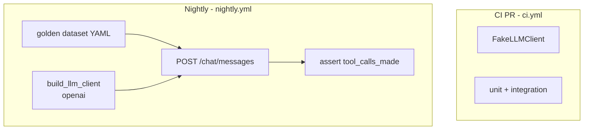

# SPEC-021 — E2E de acurácia do chat (nightly)

| Campo          | Valor                                              |
|----------------|----------------------------------------------------|
| **Status**     | Draft                                              |
| **Autor**      | @convertreino                                      |
| **Revisor**    | —                                                  |
| **Criada em**  | 2026-06-24                                         |
| **Camada**     | Infra + Application (testes)                         |
| **Depende de** | SPEC-014, SPEC-017, SPEC-020                       |
| **Bloqueia**   | Decisão sobre SPEC-016 (`period_resolver`)         |
| **Épico**      | Conversacional / Infra                             |

---

## Contexto

O LLM pode selecionar a ferramenta errada **sem erro explícito** — o risco central do épico conversacional. O `FakeLLMClient` usado no CI de PR valida o *pipeline* (orchestrator, injeção de `user_id`, contrato HTTP), mas **não** a *seleção de intenção* pelo modelo real.

A SPEC-020 define uma matriz de 10 perguntas como critério de acurácia, hoje validável apenas de forma manual ou via smoke Phoenix (SPEC-019). SPEC-014 e SPEC-017 deixaram explicitamente fora do escopo testes E2E com LLM real no CI de PR. Este gap impede detectar regressões de roteamento após mudanças em system prompt, descrições compactas de tools ou troca de provider.

Falhas recorrentes em períodos relativos (*"essa semana"*, *"neste mês"*) podem justificar a SPEC-016 (`period_resolver` server-side). Esta spec documenta o job nightly que automatiza a matriz e estabelece o gatilho para essa decisão.



---

## Escopo

### Incluído

- Golden dataset versionado em YAML com os 10 casos da matriz SPEC-020 (expandível)
- Runner pytest parametrizado por `(case_id, provider)`
- Marker `@pytest.mark.e2e` — **excluído do CI de PR** (`.github/workflows/ci.yml`)
- Workflow `.github/workflows/nightly.yml` com `workflow_dispatch` (execução manual)
- Provider no nightly: `openai` (decisão confirmada)
- Métrica primária: igualdade exata de `tool_calls_made` na response JSON
- Dados determinísticos via `InMemoryActivityRepository` + `tests/builders` (acurácia de *roteamento*, não de dados Strava)
- Relatório de acurácia no log do job (`passed/total`, lista de falhas)
- Documentação em `backend/README.md` (como rodar localmente)

### Excluído (explicitamente fora desta spec)

- Mobile E2E (Maestro/Detox) — permanece roadmap SPEC-015+
- Avaliação de qualidade do texto natural (`message.content`) — fora de escopo; só `tool_calls_made`
- Phoenix no CI nightly (SPEC-019 permanece dev-only)
- Bloquear merge de PR com base no nightly
- VCR/cassettes de respostas LLM
- Cobertura de código no job nightly

---

## Contrato

### Golden dataset — `backend/tests/e2e/fixtures/chat_intent_matrix.yaml`

```yaml
version: 1
seed:
  user_id: "aaaaaaaa-bbbb-cccc-dddd-eeeeeeeeeeee"
  activities:
    - activity_type: Run
      distance_meters: 21097
      start_date: "2024-06-01T08:00:00Z"
    - activity_type: Ride
      distance_meters: 85000
      start_date: "2024-06-02T09:00:00Z"
cases:
  - id: intent_longest_run
    question: "Qual foi minha corrida mais longa?"
    expected_tools: ["get_longest_run"]
    boundary: record_run
  - id: intent_longest_run_vs_volume
    question: "Qual a maior distância que já corri?"
    expected_tools: ["get_longest_run"]
    boundary: record_vs_volume
  - id: intent_run_volume_this_week
    question: "Quanto corri essa semana?"
    expected_tools: ["get_run_volume"]
    boundary: volume_run_relative_period
  - id: intent_run_volume_year
    question: "Quanto corri em 2024?"
    expected_tools: ["get_run_volume"]
    boundary: volume_vs_record
  - id: intent_longest_ride
    question: "Qual foi meu pedal mais longo?"
    expected_tools: ["get_longest_ride"]
    boundary: record_ride
  - id: intent_ride_volume_year
    question: "Quantos km pedalei em 2024?"
    expected_tools: ["get_ride_volume"]
    boundary: volume_ride
  - id: intent_ride_volume_this_week
    question: "Quanto pedalei essa semana?"
    expected_tools: ["get_ride_volume"]
    boundary: run_vs_ride
  - id: intent_longest_run_with_period
    question: "Qual foi minha corrida mais longa em 2024?"
    expected_tools: ["get_longest_run"]
    boundary: record_with_temporal_filter
  - id: intent_run_volume_count
    question: "Quantas corridas fiz neste mês?"
    expected_tools: ["get_run_volume"]
    boundary: aggregate_count
  - id: intent_greeting
    question: "Olá!"
    expected_tools: []
    boundary: no_tool
```

#### Campos obrigatórios por caso

| Campo            | Tipo       | Descrição                                                                 |
|------------------|------------|---------------------------------------------------------------------------|
| `id`             | `string`   | Identificador estável do caso (usado em `ids` do parametrize)             |
| `question`       | `string`   | Mensagem do usuário enviada em `POST /chat/messages`                      |
| `expected_tools` | `string[]` | Lista exata de nomes de tools esperados em `tool_calls_made`; `[]` = saudação |
| `boundary`       | `string`   | Tag documental da fronteira testada (não afeta assert)                    |

#### Campos do `seed`

| Campo        | Tipo       | Descrição                                                          |
|--------------|------------|--------------------------------------------------------------------|
| `user_id`    | UUID       | Usuário fixo para JWT e repositório in-memory                      |
| `activities` | `object[]` | Atividades mínimas para o LLM ter contexto de dados (não assertados) |

A matriz é derivada de SPEC-020 §206-221 e preserva as fronteiras críticas: recorde vs volume, Run vs Ride, período relativo/absoluto e saudação sem tool.

### Runner — assinatura conceitual

```python
# backend/tests/e2e/test_chat_intent_accuracy.py
@pytest.mark.e2e
@pytest.mark.parametrize("provider", ["openai"])
@pytest.mark.parametrize("case", load_intent_matrix(), ids=lambda c: c.id)
def test_intent_routing_accuracy(case, provider): ...
```

#### Fluxo por caso

1. Montar `ChatOrchestrator` com `build_llm_client(settings)` real (provider da matrix) e `ChatToolRegistry(InMemoryActivityRepository(seed))`
2. `set_chat_orchestrator_override(orchestrator)` + JWT override (padrão de `test_chat_messages.py`)
3. `POST /chat/messages` com `messages: [{role: user, content: question}]`
4. Assert `response.tool_calls_made == case.expected_tools`
5. Assert HTTP 200 (falha de provider → 502, caso CE)

#### Marker pytest

Registrar em `backend/pyproject.toml`:

```toml
[tool.pytest.ini_options]
markers = [
    "e2e: end-to-end tests with real LLM providers (excluded from PR CI)",
]
```

#### Exclusão no CI de PR

Adicionar `-m "not e2e"` ao comando pytest em `.github/workflows/ci.yml` para garantir que testes E2E nunca rodem em PR.

#### Execução local

```bash
# Requer OPENAI_API_KEY
E2E_LLM=1 uv run pytest -m e2e --tb=short -v
```

Sem `E2E_LLM=1` ou sem API key do provider ativo: `pytest.skip` com mensagem explícita (CE-1).

### Threshold de acurácia

| Parâmetro              | Valor                                                          |
|------------------------|----------------------------------------------------------------|
| Threshold mínimo       | **≥ 90%** (9/10 casos) no job nightly                          |
| Condição de falha      | Job falha se a acurácia ficar abaixo do threshold             |
| Retry por caso         | **1 retry** por caso falho antes de contar como falha definitiva |
| Modelo OpenAI (pin)    | `gpt-4o-mini` via `OPENAI_MODEL` no workflow                   |

O relatório final do job deve imprimir:

```
Chat intent accuracy [openai]: 9/10 (90.0%)
Failures:
  - intent_run_volume_this_week: expected ['get_run_volume'], got ['get_longest_run']
```

### Workflow nightly — `.github/workflows/nightly.yml`

```yaml
on:
  workflow_dispatch:

jobs:
  chat-accuracy:
    env:
      LLM_PROVIDER: openai
      OPENAI_API_KEY: ${{ secrets.OPENAI_API_KEY }}
      OPENAI_MODEL: gpt-4o-mini
    steps:
      - # checkout, uv, postgres (igual ci.yml — serviço disponível mas E2E usa InMemory)
      - run: uv run pytest -m e2e --tb=short -v
      - # step de agregação: calcular passed/total, falhar job se < 90%
```

**Secret obrigatório** no repositório GitHub: `OPENAI_API_KEY`.

### Efeitos colaterais

- Chamadas HTTP reais ao provider OpenAI (custo e latência)
- Nenhuma escrita em banco de produção; repositório in-memory apenas
- Nenhum impacto em merge de PR

---

## Comportamentos

### Casos normais (Happy Path)

#### CN-1: Pergunta de recorde Run roteia corretamente
**Dado** o golden dataset com caso `intent_longest_run`  
**E** provider OpenAI configurado com API key válida  
**Quando** `test_intent_routing_accuracy` envia `"Qual foi minha corrida mais longa?"`  
**Então** `POST /chat/messages` retorna HTTP 200  
**E** `tool_calls_made == ["get_longest_run"]`

#### CN-2: Pergunta de volume Run com período roteia corretamente
**Dado** o caso `intent_run_volume_this_week`  
**Quando** a pergunta `"Quanto corri essa semana?"` é enviada  
**Então** `tool_calls_made == ["get_run_volume"]`

#### CN-3: Saudação não aciona tool
**Dado** o caso `intent_greeting`  
**Quando** a pergunta `"Olá!"` é enviada  
**Então** `tool_calls_made == []`  
**E** `message.content` não vazio (resposta direta do LLM)

#### CN-4: Job nightly atinge threshold
**Dado** o workflow nightly com `LLM_PROVIDER=openai`
**Quando** todos os 10 casos são executados (com até 1 retry por falha)
**Então** acurácia ≥ 90% (≥ 9/10 casos passando)
**E** relatório impresso no log do job

### Casos de borda (Edge Cases)

#### CB-1: Fronteira recorde vs volume
**Dado** os casos `intent_longest_run_vs_volume` e `intent_run_volume_year`  
**Quando** perguntas sobre *maior distância* vs *quanto corri* são enviadas  
**Então** o LLM seleciona `get_longest_run` vs `get_run_volume` respectivamente  
**E** falha documentada no relatório nightly se confundir as fronteiras

#### CB-2: Fronteira Run vs Ride
**Dado** os casos `intent_longest_run` vs `intent_longest_ride` e `intent_ride_volume_this_week`  
**Quando** perguntas usam vocabulário de corrida vs pedal  
**Então** tools Run (`get_longest_run`, `get_run_volume`) vs Ride (`get_longest_ride`, `get_ride_volume`) são selecionadas corretamente

#### CB-3: Filtro temporal em recorde e volume
**Dado** os casos `intent_longest_run_with_period`, `intent_run_volume_this_week` e `intent_run_volume_count`  
**Quando** perguntas incluem período relativo (*"essa semana"*, *"neste mês"*) ou absoluto (*"em 2024"*)  
**Então** a tool correta é selecionada independentemente do período  
**E** falhas recorrentes (≥ 3 noites consecutivas) disparam gatilho para abrir SPEC-016

### Casos de erro

#### CE-1: API key ausente
**Dado** que `E2E_LLM=1` não está definido **ou** a API key do provider ativo está ausente  
**Quando** o teste E2E é coletado ou executado localmente  
**Então** `pytest.skip` com mensagem indicando variável/key necessária  
**E** no nightly, job com secret ausente deve falhar com aviso explícito (não silenciosamente passar)

#### CE-2: Provider retorna 502
**Dado** que o provider LLM está indisponível (timeout, 5xx, rate limit)  
**Quando** `POST /chat/messages` é chamado no teste E2E  
**Então** o caso conta como **falha** (não skip)  
**E** entra no cálculo de acurácia e no relatório de falhas

#### CE-3: Loop de tools excede limite
**Dado** que o LLM entra em loop sem resposta final  
**Quando** `CHAT_MAX_TOOL_ITERATIONS` é excedido  
**Então** HTTP 500 com `detail == "Chat processing failed"`  
**E** o caso conta como falha no nightly

---

## Critérios de Aceite

- [ ] Arquivo `specs/SPEC-021-chat-accuracy-e2e-nightly.md` com status Draft
- [ ] Golden dataset YAML com 10 casos da matriz SPEC-020 em `backend/tests/e2e/fixtures/chat_intent_matrix.yaml`
- [ ] Marker `e2e` registrado em `backend/pyproject.toml`
- [ ] Testes em `backend/tests/e2e/test_chat_intent_accuracy.py`
- [ ] CI PR exclui `-m "not e2e"`; nightly roda só `-m e2e`
- [ ] Workflow `.github/workflows/nightly.yml` com `workflow_dispatch` + provider openai
- [ ] README atualizado: variáveis, comando local (`E2E_LLM=1 uv run pytest -m e2e`)
- [ ] Roadmaps de SPEC-014, SPEC-017 e SPEC-020 referenciam SPEC-021 como implementação do E2E adiado
- [ ] Relatório de acurácia impresso ao final do job nightly

---

## Mapeamento Spec → Testes

| Comportamento              | Arquivo                                              |
|----------------------------|------------------------------------------------------|
| CN-1..CN-3, CB-1..CB-3     | `backend/tests/e2e/test_chat_intent_accuracy.py`     |
| Golden dataset             | `backend/tests/e2e/fixtures/chat_intent_matrix.yaml` |
| Loader YAML                | `backend/tests/e2e/conftest.py` ou helper em `tests/e2e/` |
| Exclusão no PR             | `.github/workflows/ci.yml` (`-m "not e2e"`)          |
| Nightly                    | `.github/workflows/nightly.yml`                      |

---

## Decisões de Design

### Decisão: `tool_calls_made` como única métrica automatizada
**Contexto:** Como medir acurácia de roteamento sem avaliar qualidade do texto.  
**Opção escolhida:** Igualdade exata de `tool_calls_made` na response JSON.  
**Alternativas rejeitadas:** Avaliar `message.content` com LLM-as-judge; assert parcial de subset de tools.  
**Motivo:** Alinhado à SPEC-014 §459 e SPEC-020 §297; determinístico e barato de assertar.

### Decisão: InMemory repo, não Postgres
**Contexto:** Qual fonte de dados usar no E2E de roteamento.  
**Opção escolhida:** `InMemoryActivityRepository` com seed fixo do YAML.  
**Alternativas rejeitadas:** Postgres de teste com fixtures Strava.  
**Motivo:** E2E testa seleção de intenção pelo LLM; dados analíticos já cobertos por unitários/integration.

### Decisão: Job único com OpenAI no nightly
**Contexto:** Como executar o provider LLM no nightly.  
**Opção escolhida:** Job único com `LLM_PROVIDER=openai`.  
**Alternativas rejeitadas:** Matrix com OpenAI e Groq em jobs paralelos; um job sequencial com ambos providers.  
**Motivo:** Custo e latência menores; OpenAI como provider principal de referência para acurácia de roteamento.

### Decisão: Threshold 90%, não 100%
**Contexto:** Variância inerente de modelos LLM em tool selection.  
**Opção escolhida:** ≥ 90% (9/10); job falha abaixo disso.  
**Alternativas rejeitadas:** 100% obrigatório; threshold por caso individual.  
**Motivo:** Tolerância a flakes ocasionais; falhas documentadas no log para investigação.

### Decisão: Não bloquear PR
**Contexto:** O nightly deve ser gate de merge?  
**Opção escolhida:** Não — nightly é sinal de regressão, não gate de merge.  
**Alternativas rejeitadas:** Required check no nightly para merge.  
**Motivo:** Guia §8: testes E2E são "lentos, rodados em CI nightly"; PR CI permanece rápido com `FakeLLMClient`.

### Decisão: 1 retry por caso antes de contar falha
**Contexto:** Mitigar flakes de API (rate limit transitório, timeout).  
**Opção escolhida:** Reexecutar cada caso falho uma vez antes de registrar falha definitiva.  
**Alternativas rejeitadas:** Sem retry; retry ilimitado.  
**Motivo:** Equilíbrio entre estabilidade do nightly e custo de API.

### Decisão: Gatilho SPEC-016 via CB-3
**Contexto:** Quando abrir spec de `period_resolver` server-side.  
**Opção escolhida:** Se casos com filtro temporal (CB-3) falharem ≥ 3 noites consecutivas, abrir SPEC-016.  
**Alternativas rejeitadas:** Gatilho imediato após primeira falha; ignorar falhas de período.  
**Motivo:** Evita decisão prematura por variância pontual; confirma padrão sistêmico de falha na conversão de períodos pelo LLM.

---

## Notas de Migração

### Atualizações em specs predecessoras

| Spec     | Alteração                                                                                    |
|----------|----------------------------------------------------------------------------------------------|
| SPEC-014 | Campo **Bloqueia** atualizado para SPEC-021; roadmap inclui E2E nightly                    |
| SPEC-017 | Campo **Bloqueia** atualizado para SPEC-021; "Testes E2E com Groq real" desbloqueados       |
| SPEC-020 | Matriz de intenções: "manual ou nightly futuro" → "automatizado em SPEC-021"               |
| SPEC-013 | Roadmap: falhas CB-3 do nightly alimentam gatilho SPEC-016                                   |
| SPEC-015 | Roadmap: falhas CB-3 do nightly alimentam gatilho SPEC-016                                   |

### Ordem de implementação pós-aprovação (TDD)


1. Registrar marker `e2e` + fixture YAML + loader
2. Escrever testes falhando (Red) com skip se sem API key
3. Ajustar CI PR para excluir `e2e`
4. Criar workflow nightly
5. Rodar localmente com keys reais e calibrar threshold
6. Atualizar roadmaps das specs predecessoras (já feito na aprovação desta spec)

### Secrets GitHub

Adicionar ao repositório antes do primeiro nightly:

- `OPENAI_API_KEY`

---

## Checklist de revisão (seção 12 do guia)

### Clareza
- [x] O contexto explica o problema (gap entre FakeLLM e seleção real de intenção)?
- [x] O contrato tem formato YAML, runner e threshold explícitos?
- [x] Cada comportamento tem "Dado / Quando / Então" completo?
- [x] Os critérios de aceite são binários e verificáveis?

### Completude
- [x] Casos normais, borda e erro cobertos (CN/CB/CE)
- [x] Escopo excluído explícito (mobile E2E, content quality, Phoenix, VCR)
- [x] Golden dataset com os 10 casos da matriz SPEC-020
- [x] Gatilho SPEC-016 documentado

### Consistência
- [x] Não contradiz SPEC-014 (contrato HTTP, `tool_calls_made`)
- [x] Compatível com provider OpenAI (SPEC-017 mantém Groq no app, fora do nightly)
- [x] Matriz alinhada à SPEC-020 §206-221
- [x] Padrão de override consistente com `test_chat_messages.py`

### Testabilidade
- [x] Cada comportamento mapeia para teste E2E parametrizado
- [x] Seed determinístico via InMemory + builders
- [x] Exclusão do PR CI e execução nightly separados e verificáveis
